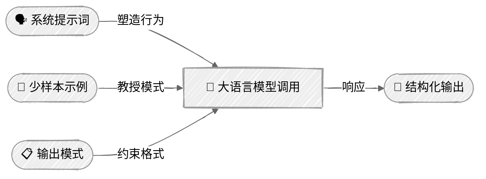

<!-- ---
title: "提示工程"
description: "学习系统消息、少样本示例和结构化输出等提示工程技术"
icon: "wand"
--- -->

# 提示工程

学习如何通过提示技术塑造大语言模型的行为。每个 AI 智能体的能力都始于其提示词的设计方式——本教程涵盖你构建每个智能体时都会用到的核心技术。

## 🎯 你将学到什么

- 使用系统提示词和角色工程控制大语言模型的行为
- 应用少样本提示进行上下文学习
- 使用思维链（CoT）提示引导推理
- 通过提示词指令提取结构化 JSON 输出
- 使用供应商特有的技术：Anthropic XML 脚手架、OpenAI JSON Schema 强制执行
- 并排比较不同提示策略，了解各自的权衡

## 📦 可用示例

| 供应商                                          | 文件                                                                   | 说明                                                        |
| ----------------------------------------------- | ---------------------------------------------------------------------- | ----------------------------------------------------------- |
|  | [01_system_prompts_anthropic.py](01_system_prompts_anthropic.py)       | 系统提示词与角色工程                                        |
|        | [02_system_prompts_openai.py](02_system_prompts_openai.py)             | 系统提示词与角色工程                                        |
|  | [03_few_shot_cot_anthropic.py](03_few_shot_cot_anthropic.py)           | 零样本、少样本与思维链演示                                  |
|        | [04_few_shot_cot_openai.py](04_few_shot_cot_openai.py)                 | 零样本、少样本与思维链演示                                  |
|  | [05_structured_output_anthropic.py](05_structured_output_anthropic.py) | 产品信息提取——提示词、XML 脚手架与原生模式                  |
|        | [06_structured_output_openai.py](06_structured_output_openai.py)       | 产品信息提取——提示词、脚手架与模式强制执行                  |

## 🚀 快速开始

> **前置条件：** Python 3.11+、API 密钥和 uv。完整的设置说明请参阅 [SETUP.md](../../SETUP.md)。

```bash
uv run --directory 01-foundations/02-prompt-engineering python {script_name}

# 示例
uv run --directory 01-foundations/02-prompt-engineering python 01_system_prompts_anthropic.py
```

也可以使用 VS Code 的 [Code Runner](https://marketplace.visualstudio.com/items?itemName=formulahendry.code-runner) 扩展，单击一次即可运行当前打开的脚本。

## 🔑 核心概念

### 1. 提示工程的层次



每一层都会增强对大语言模型响应的控制。组合使用这些层次，就能构建可生成可靠、可解析输出的智能体。

### 2. 系统提示词与角色工程

系统提示词是控制智能体行为的主要手段。这些脚本针对同一个支持工单分类任务比较三个逐步优化的层次——一张含义模糊的工单会迫使每种提示词决定如何解读工单，以及优先处理什么：

| 配置                       | 作用                                                        |
| -------------------------- | ----------------------------------------------------------- |
| **通用助手**               | 基线——“你是一名乐于助人的助手”（措辞保守，给出通用建议）    |
| **指定角色的专家**         | 身份 + 领域专业知识 + 决断力（作出明确判断）                 |
| **角色 + 约束 + 格式**     | 包含以上全部内容 + 严格的输出分节（简洁、可执行）            |

**Anthropic**——将系统提示词作为顶层参数：

```python
response = client.messages.create(
    model="claude-sonnet-4-6",
    system="你是一家 SaaS 公司的高级支持工程师……",  # 系统提示词
    messages=[{"role": "user", "content": "分析这张支持工单……"}],
)
```

**OpenAI**——通过 `instructions` 传入系统提示词：

```python
response = client.responses.create(
    model="gpt-4o",
    instructions="你是一家 SaaS 公司的高级支持工程师……",  # 系统提示词
    input="分析这张支持工单……",
)
```

> 系统提示词越具体、约束越明确，输出就越一致、越有用。这是智能体最重要的提示工程技术。

### 3. 少样本与思维链

这些脚本演示三种技术，每种技术都用于最适合它的任务，以说明为什么要选择其中一种而不是其他技术：

| 技术         | 演示任务             | 选择该技术的原因                                      |
| ------------ | -------------------- | ----------------------------------------------------- |
| **零样本**   | 情感分析             | 模型已经理解“正面/负面/中性”                          |
| **少样本**   | 自定义标签分类       | 教授 `BILLING_DISPUTE` 等领域标签                     |
| **思维链**   | 根本原因分析         | 多步推理可以得到更好的诊断结果                        |

**零样本**——任务定义清晰时不需要示例：

```python
system = (
    "对以下产品评价的情感进行分类。\n"
    "只能用一个词作答：正面、负面或中性。"
)
```

**少样本**——通过示例向模型教授你自己的分类体系：

```python
EXAMPLES = [
    ("同一项订阅向我收取了两次费用", "BILLING_DISPUTE"),
    ("重置密码后仍然无法登录", "ACCOUNT_ACCESS"),
]

examples_text = "\n".join(
    f'工单："{text}"\n类别：{label}' for text, label in EXAMPLES
)
```

**思维链**——对复杂问题进行逐步推理：

```python
system = (
    "逐步分析这份缺陷报告：\n"
    "1. 你观察到了哪些模式？（时间、范围、触发条件）\n"
    "2. 每条线索支持或排除了哪些可能性？\n"
    "3. 最可能的根本原因是什么？\n"
    "4. 你会首先检查什么来验证结论？"
)
```

> **如何选择：** 对常见任务使用零样本方法（速度快、成本低）。需要自定义标签或领域特定分类时使用少样本方法（需要更多输入 Token）。推理任务的准确性比速度更重要时使用思维链（需要更多输出 Token）。

### 4. 结构化输出与脚手架

智能体必须生成可解析的输出。每个脚本都使用三种方法从同一段描述中提取产品数据，便于比较可靠性：

```python
# 所有方法共用的产品信息提取模式
class ProductExtraction(BaseModel):
    name: str
    category: str
    price: float
    features: list[str]
    in_stock: bool
```

**Anthropic——通过 `output_config` 使用原生 JSON Schema（推荐）：**

```python
# 在 API 层强制执行模式——保证 JSON 有效
response = client.messages.parse(
    model="claude-sonnet-4-6",
    messages=[{"role": "user", "content": product_description}],
    output_format=ProductExtraction,
)
product = response.parsed_output  # 经过验证的 Pydantic 模型实例
```

**Anthropic——XML 脚手架（提示技术）：**

```python
# XML 标签构造输入结构——清楚地区分模式与数据
messages = [
    {"role": "user", "content": "<schema>...</schema>\n<product_description>...</product_description>"},
]
```

> **注意：** 早期 Claude 模型支持“助手消息预填充”——在助手轮次中预先放入 `{` 以强制输出 JSON。Claude 4.6 已[移除对此功能的支持](https://platform.claude.com/docs/en/about-claude/models/whats-new-claude-4-6#breaking-changes)：对话必须以用户消息结束。如果现在需要类似预填充的保证，请优先使用下方的原生模式强制执行。

**OpenAI——原生 JSON Schema 强制执行：**

```python
response = client.responses.create(
    model="gpt-4o",
    instructions="提取产品信息……",
    input=product_description,
    text={"format": {
        "type": "json_schema",
        "name": "product_extraction",
        "strict": True,
        "schema": { ... }
    }},
)
```

> **两家供应商现在都提供模式强制执行。** Anthropic 的 `output_config` 和 OpenAI 的 `text.format` 都通过约束解码保证 JSON 有效。需要更精细地控制提示策略时，基于提示词的技术（XML 脚手架）仍然很有用。

### 5. 输出验证

对于基于提示词的方法，始终要验证结构化输出。原生模式强制执行会自动处理验证，但仍需检查拒绝响应（`stop_reason: "refusal"`）和 Token 上限（`stop_reason: "max_tokens"`），这些情况可能产生不符合模式的输出：

```python
def try_parse_json(raw: str) -> dict | None:
    text = raw.strip()
    # 如果大语言模型添加了 Markdown 代码围栏，则将其移除
    if text.startswith("```"):
        lines = text.splitlines()
        text = "\n".join(lines[1:-1])
    try:
        return json.loads(text)
    except json.JSONDecodeError:
        return None
```

## ⚠️ 重要注意事项

- **提示词注入**——系统提示词可能被恶意用户输入覆盖。切勿仅依靠提示词建立安全边界。这一点在[工具使用](../04-tool-use/README.md)中至关重要。
- **Token 成本**——少样本示例会增加每次调用的输入 Token。对于高调用量的智能体，应评估准确率提升是否值得相应成本。
- **JSON 可靠性**——基于提示词的 JSON 提取可能失败。在生产环境中，应使用供应商原生的模式强制执行（Anthropic `output_config`、OpenAI `text.format`）来保证 JSON 有效。
- **温度**——对于重视一致性的分类和结构化输出任务，请设置 `temperature=0.0`。这些脚本都使用较低温度，以获得可复现的结果。

## 👉 后续步骤

掌握提示工程后，可以继续：

- **[聊天](../03-chat/README.md)**——添加对话历史和多轮交互
- **实验**——尝试不同的角色描述、添加更多少样本示例，或组合多个脚本中的技术
- **探索**——修改分类类别或任务模式，使其适合你的领域
