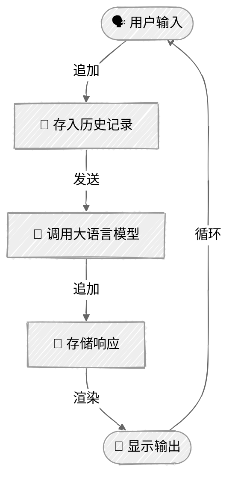

<!-- ---
title: "交互式聊天"
description: "使用 Anthropic Claude 和 OpenAI GPT 构建带消息历史记录的交互式聊天循环"
icon: "message-circle"
--- -->

# 交互式聊天

构建一个具备对话历史管理功能的交互式聊天应用。本教程演示如何在多轮对话中保持上下文，并打造自然流畅的对话体验。

## 🎯 你将学到什么

- 实现接收用户输入的交互式聊天循环
- 管理多轮对话的历史记录
- 保持上下文，让多轮对话自然连贯
- 跟踪 token 用量和对话统计信息
- 使用丰富的控制台输出改善用户体验

## 📦 可用示例

| 提供商                                          | 文件                                         | 说明                                      |
| ----------------------------------------------- | -------------------------------------------- | ----------------------------------------- |
|  | [01_chat_anthropic.py](01_chat_anthropic.py) | 使用 Claude Messages API 的交互式聊天     |
|        | [02_chat_openai.py](02_chat_openai.py)       | 使用 OpenAI Responses API 的交互式聊天    |

## 🚀 快速开始

> **前置条件：** Python 3.11+、API 密钥和 uv。完整配置说明请参阅 [SETUP.md](../../SETUP.md)。

```bash
uv run --directory 01-foundations/03-chat python {script_name}

# 示例
uv run --directory 01-foundations/03-chat python 01_chat_anthropic.py
```

你也可以使用 VS Code 的 [Code Runner](https://marketplace.visualstudio.com/items?itemName=formulahendry.code-runner) 扩展，单击一下即可运行当前打开的脚本。

## 🔑 核心概念

### 1. 聊天循环模式



### 2. 消息历史管理

实现多轮对话的关键是维护一个消息历史数组：

**Anthropic：**

```python
class ChatSession:
    def __init__(self, model: str):
        self.client = anthropic.Anthropic()
        self.messages: list[dict[str, str]] = []
        self.model = model

    def send_message(self, user_message: str) -> str:
        # 将用户消息添加到历史记录
        self.messages.append({"role": "user", "content": user_message})

        # 将完整的历史记录发送给 API
        response = self.client.messages.create(
            model=self.model,
            messages=self.messages,
        )

        # 提取响应
        assistant_message = response.content[0].text

        # 将助手响应添加到历史记录
        self.messages.append({"role": "assistant", "content": assistant_message})

        return assistant_message
```

**OpenAI：**

```python
class ChatSession:
    def __init__(self, model: str):
        self.client = OpenAI()
        self.messages: list[dict[str, str]] = []
        self.model = model

    def send_message(self, user_message: str) -> str:
        # 将用户消息添加到历史记录
        self.messages.append({"role": "user", "content": user_message})

        # 使用 Responses API 发送完整的历史记录
        response = self.client.responses.create(
            model=self.model,
            input=self.messages,
        )

        # 提取响应
        assistant_message = response.output_text or ""

        # 将助手响应添加到历史记录
        self.messages.append({"role": "assistant", "content": assistant_message})

        return assistant_message
```

### 3. 交互式聊天循环

创建一个持续运行的对话流程：

```python
def main() -> None:
    console = Console()
    chat = ChatSession("model-name")

    # 欢迎消息
    console.print(Panel("欢迎使用聊天程序！"))

    # 交互式循环
    while True:
        # 获取用户输入
        console.print("你：", end="")
        user_input = input().strip()

        # 退出条件
        if user_input.lower() in ["quit", "exit", ""]:
            break

        # 处理消息
        try:
            response = chat.send_message(user_input)
            console.print(f"助手：{response}")
        except Exception as e:
            console.print(f"错误：{e}")
            break
```

### 4. Token 跟踪

监控整个对话过程中的 API 用量：

**Anthropic：**

```python
token_tracker = AnthropicTokenTracker()

# 每次调用 API 后
response = self.client.messages.create(...)
token_tracker.track(response.usage)

# 会话结束时
token_tracker.report()  # 显示输入、输出和费用总计
```

**OpenAI：**

```python
token_tracker = OpenAITokenTracker()

# 每次调用 API 后
response = self.client.responses.create(...)
token_tracker.track(response.usage)

# 会话结束时
token_tracker.report()  # 显示输入、输出和费用总计
```

## ⚠️ 重要注意事项

**上下文窗口限制**：随着对话增长，消息历史会占用越来越多的 token，最终将达到模型的上下文窗口上限。处理这一问题的进阶方法包括：

- 截断较早的消息
- 总结对话历史
- 使用滑动窗口

**错误处理**：生产环境中的聊天应用应处理：

- 网络错误和 API 故障
- 速率限制和重试
- 无效的用户输入
- 超出 token 限制的错误

**成本管理**：每条消息都会发送完整的对话历史。对话越长，每条消息的成本越高。请仔细监控 token 用量。

这些策略将在后续教程中介绍。

## 👉 后续步骤

构建好交互式聊天会话后，可以继续：

- **[工具使用](../04-tool-use/README.md)**：为聊天智能体添加外部能力
- **实验**：尝试不同的对话流程和系统提示词
- **增强**：添加对话摘要或历史记录持久化等功能
