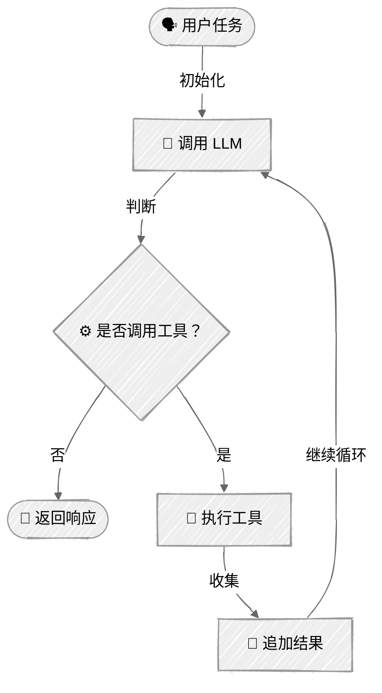

<!-- ---
title: "智能体循环"
description: "构建通过反复使用工具来完成复杂目标的自主智能体"
icon: "repeat"
--- -->

# 智能体循环

学习如何构建在循环中使用工具来完成任务的自主编程智能体。本教程演示了 AI 智能体背后的核心模式：反复调用大语言模型（LLM）、执行模型请求的工具，并将结果反馈给模型，直到任务完成。

## 🎯 你将学到什么

- 实现智能体循环的核心模式（调用 LLM → 执行工具 → 反馈结果）
- 使用文件系统工具（`read_file`、`write_file`、`bash`）构建编程智能体
- 在对话流程中处理工具调用及其结果
- 构建具备完善错误处理能力的交互式命令行智能体

## 📦 可用示例

| 提供商                                          | 文件                                                         | 说明                                                         |
| ----------------------------------------------- | ------------------------------------------------------------ | ------------------------------------------------------------ |
|  | [01_minimal_agent.py](01_minimal_agent.py)                   | 带有人机协同确认机制的最小智能体循环（约 55 行）             |
|  | [02_coding_agent_anthropic.py](02_coding_agent_anthropic.py) | 使用 Claude Messages API 的完整编程智能体                    |
|        | [03_coding_agent_openai.py](03_coding_agent_openai.py)       | 使用 OpenAI Responses API 的编程智能体                       |

## 🚀 快速开始

> **前置条件：** Python 3.11+、API 密钥和 uv。完整的环境配置说明请参阅 [SETUP.md](../../SETUP.md)。

```bash
uv run --directory 01-foundations/05-agent-loop python {script_name}

# 示例
uv run --directory 01-foundations/05-agent-loop python 01_minimal_agent.py
```

你也可以使用 VS Code 的 [Code Runner](https://marketplace.visualstudio.com/items?itemName=formulahendry.code-runner) 扩展，一键运行当前打开的脚本。

## 🔑 核心概念

### 1. 智能体循环模式

核心模式很简单：调用 LLM，执行它请求的所有工具，将结果反馈给它，然后重复这一过程，直到任务完成。



```python
while iteration < max_iterations:
    # 1. 调用模型并提供工具
    response = client.messages.create(
        model=model,
        tools=TOOLS,
        messages=messages,
    )

    # 2. 如果没有工具调用，则任务已完成
    if response.stop_reason == "end_turn":
        return response.content[0].text

    # 3. 执行工具并收集结果
    for tool_call in response.tool_calls:
        result = execute_tool(tool_call.name, tool_call.input)
        tool_results.append(result)

    # 4. 将结果添加到对话中并继续
    messages.append(tool_results)
```

### 2. 工具

工具的定义和执行方式已在[工具使用](../04-tool-use/README.md)中介绍。本教程使用三个工具：`read_file`、`write_file` 和 `bash`。

### 3. 追加工具结果

**Anthropic** — 将助手响应和工具结果作为消息追加：

```python
messages.append({"role": "assistant", "content": response.content})
messages.append({"role": "user", "content": tool_results})
```

**OpenAI Responses API** — 以 `input` 形式传递工具输出，并设置 `previous_response_id`：

```python
tool_outputs = [
    {
        "type": "function_call_output",
        "call_id": call.call_id,
        "output": json.dumps({"result": result}),
    }
    for call, result in zip(function_calls, results)
]
response = client.responses.create(
    model=model,
    tools=TOOLS,
    input=tool_outputs,
    previous_response_id=response.id,
)
```

## 🏗️ 代码结构

两个完整示例采用一致的结构：

```python
SYSTEM_PROMPT = """你是一个编程智能体……"""

TOOLS = [...]  # 工具定义

def execute_tool(name: str, tool_input: dict) -> str:
    """执行工具并返回结果。"""
    ...

class CodingAgent:
    """在循环中使用工具的自主智能体。"""

    def __init__(self, model: str):
        self.client = ...
        self.model = model
        self.max_iterations = 10

    def run(self, task: str) -> str:
        """针对给定任务执行智能体循环。"""
        # 智能体循环的实现
        ...

def main() -> None:
    """带欢迎消息的交互式命令行界面。"""
    agent = CodingAgent()

    while True:
        user_input = input("你：")
        if user_input.lower() in ("exit", "quit", "q"):
            break
        response = agent.run(user_input)
        print(f"智能体：{response}")
```

## 👉 后续步骤

掌握智能体循环模式后，你可以：

- 添加更多工具（网页搜索、数据库查询、API 调用）
- 为破坏性操作实现工具执行确认机制
- 为较长的对话添加记忆和上下文管理
- 探索流式响应，以改善用户体验
