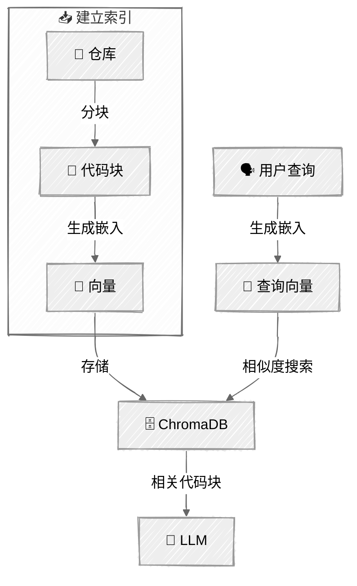

<!-- ---
title: "代码库导航器"
description: "一个使用检索、工具和记忆来探索代码库的增强型 LLM 智能体"
icon: "layers"
--- -->

# 代码库导航器

一个帮助工程师探索和理解陌生代码库的智能体。只需指定任意 GitHub 仓库，它便会克隆并建立索引，利用语义搜索回答问题，同时跨会话保留记忆。

> 本示例实现了 Anthropic《[构建高效智能体](https://www.anthropic.com/engineering/building-effective-agents)》中的**增强型 LLM** 模式，即通过检索、工具和记忆来增强 LLM。

> **📚 环境配置与运行：**有关前置条件、配置步骤和教程运行方式，请参阅 [SETUP.md](../../SETUP.md)。

## 🎯 你将学到什么

- 理解作为所有智能体模式基础的**增强型 LLM**
- 使用 ChromaDB 和 sentence-transformers 实现**检索增强生成（RAG）**
- 通过智能体循环将 LLM 连接到它能够自主调用的**工具**
- 添加持久化**记忆**，跨会话保留上下文
- 构建一个能够探索真实代码库的实用智能体

## 📦 可用示例

| # | 脚本 | 提供商 | 演示内容 |
|---|------|--------|----------|
| 01 | `01_codebase_navigator.py` |  | 包含 RAG、工具和记忆的完整增强型 LLM |

> **欢迎贡献！**我们希望有人协助将本教程移植到更多模型提供商。若有意参与，请参阅 [#13 — 移植到 OpenAI API](https://github.com/agenticloops-ai/ai-agents-engineering/issues/13)。

## 🔑 核心概念

### 增强能力

**检索（RAG）**——使用 ChromaDB 和 sentence-transformers 对已索引的代码库进行语义搜索。智能体会生成搜索查询，根据含义而不只是关键词找到相关代码块。

| 组件 | 说明 |
|------|------|
| **向量存储** | 保存代码块嵌入向量的本地 ChromaDB |
| **分块** | 使用 Tree-sitter 按 AST 结构感知的方式对函数、类和模块分块 |
| **嵌入** | 使用 sentence-transformers（`all-MiniLM-L6-v2`）在本地生成嵌入向量 |

**工具**——克隆仓库、读取文件、搜索代码，以及通过 grep 搜索模式。LLM 决定何时使用哪些工具，并通过 Anthropic 原生工具调用 API 执行它们。

| 工具 | 用途 | 使用示例 |
|------|------|----------|
| `clone_and_index` | 克隆 GitHub 仓库并建立索引 | “为 pallets/flask 建立索引” |
| `list_repos` | 列出所有已索引仓库 | “我有哪些仓库？” |
| `search_code` | 对代码进行语义搜索 | “路由是如何工作的？” |
| `read_file` | 读取带行号的文件 | 读取指定文件 |
| `list_directory` | 探索仓库结构 | “显示项目结构” |
| `grep` | 使用正则表达式搜索模式 | “查找所有 TODO 注释” |
| `save_memory` | 持久化事实、见解或偏好 | 发现模式时自动保存 |
| `recall_memory` | 检索已保存的记忆 | 会话开始时自动检索 |

**记忆**——使用持久化 JSON 存储事实、见解和用户偏好。每次会话开始时，记忆都会载入系统提示词，让智能体获得之前对话的上下文。

这样便能进行上下文相关的追问，例如：

> *“之前你在 `src/auth/` 中找到了身份验证逻辑——需要我继续查找相关中间件吗？”*

### 智能体循环

这是使整个程序正常工作的核心模式（与[智能体循环](../05-agent-loop/README.md)教程相同）。

循环会持续运行，直到 LLM 只返回文本（不再调用工具），这表示它已经获得足够的信息来回答问题。

### RAG 流程



**分块策略**：Python 文件按顶层 `class`/`def` 定义拆分。其他文件每 50 行拆分一次，并保留 10 行重叠。这些简单的启发式规则很适合教学用途。

**嵌入模型**：通过 sentence-transformers 使用 `all-MiniLM-L6-v2`。该模型轻量、可在本地运行，并且不需要外部 API。

## 🏗️ 代码结构

```
06-codebase-navigator/
├── 01_codebase_navigator.py       # 主入口——智能体与命令行界面
├── store/
│   ├── memory.py                  # 基于 JSON 的持久化记忆
│   └── vector.py                  # ChromaDB 嵌入向量封装
├── indexer/
│   ├── chunker.py                 # 文件分块策略
│   └── embedder.py                # sentence-transformers 嵌入
├── tools/
│   ├── memory.py                  # save_memory、recall_memory
│   ├── repo.py                    # clone_and_index、list_repos
│   ├── files.py                   # read_file、list_directory
│   └── search.py                  # search_code、grep
├── repos/                         # 克隆的仓库（被 Git 忽略）
├── data/                          # ChromaDB 持久化数据（被 Git 忽略）
└── memory.json                    # 持久化记忆（被 Git 忽略）
```

## 💬 会话示例

```
代码库导航器

> 为 pallets/flask 的 Flask 仓库建立索引
  [工具：clone_and_index] {"repo":"pallets/flask"}
  → 已为“pallets/flask”建立索引：142 个文件，847 个代码块。现在可以搜索了！

导航器：
已成功为 pallets/flask 建立索引。你想探索什么？

> 路由是如何工作的？
  [工具：search_code] {"query":"路由请求处理","repo":"pallets-flask"}
  → “路由请求处理”的搜索结果

导航器：
Flask 的路由建立在 Werkzeug 路由系统之上，工作方式如下：

1. **路由注册**（`src/flask/scaffold.py:42`）
   路由通过 `@app.route()` 装饰器注册……

2. **URL 映射**（`src/flask/app.py:315`）
   Flask 维护一个 Werkzeug `Map` 对象……

> 查找所有 TODO 注释
  [工具：grep] {"pattern":"TODO","repo":"pallets-flask"}
  → 找到 3 个与 `TODO` 匹配的结果

导航器：
在 Flask 代码库中找到 3 条 TODO 注释：
- `src/flask/testing.py:89`——TODO：在 3.1 版本中弃用此项
……
```

## ⚠️ 重要注意事项

- **嵌入模型的选择**——我们使用 `all-MiniLM-L6-v2`，因为它体积小（约 80 MB），无需额外 API 密钥即可在本地运行，也足以用于 RAG 教学。生产环境的代码搜索可考虑代码专用模型，如 CodeBERT 或 OpenAI 嵌入模型
- **首次运行时下载嵌入模型**——模型会从 Hugging Face 下载一次并缓存在本地
- **大型仓库建立索引需要时间**——对数百个文件进行分块和生成嵌入需要耐心等待
- **ChromaDB 在本地持久化**——已索引仓库存储在 `./data/chroma/` 中，程序重启后仍会保留
- **记忆会无限增长**——在生产环境中，应限制旧记忆的数量或对其进行摘要
- **没有 AST 解析**——分块使用简单的按行启发式规则，而不是能够感知编程语言的解析方式

## 👉 后续步骤

- **[提示链](../../02-effective-agents/01-prompt-chaining/README.md)**——将任务分解为连续的 LLM 调用
- 尝试为多个仓库建立索引，并提出跨仓库问题
- 尝试不同的嵌入模型
- 添加新工具（例如 `run_tests`、`explain_function`）
- 尝试不同的分块策略，以获得更好的搜索结果
