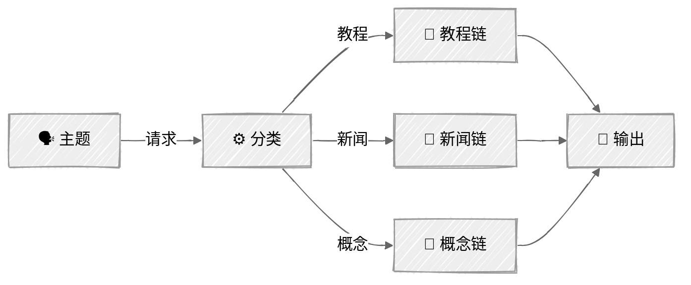

<!-- ---
title: "路由"
description: "对传入请求进行分类，并将其分派给专门的处理器"
icon: "split"
--- -->

# 路由——内容策略师

根据内容分析结果，将请求路由到专门的处理器。路由器选择的是正确的*结构*，而不仅仅是正确的语气——路由错误意味着整个输出格式都会出错。

## 🎯 你将学到什么

- 使用由大语言模型驱动的结构化输出（工具调用）对输入进行分类
- 为结构不同的内容类型设计专用链
- 理解通用提示词为何只能产生平庸的结果
- 构建“分类器 → 专用链”路由系统

## 📦 可用示例

| 提供商 | 文件 | 说明 |
|--------|------|------|
|  | [01_routing.py](01_routing.py) | 包含 3 条专用路由的内容策略师 |

## 🚀 快速开始

> **前置条件：** Python 3.11+、API 密钥和 uv。完整的配置说明请参阅 [SETUP.md](../../SETUP.md)。

```bash
uv run --directory 02-effective-agents/02-routing python {script_name}

# 示例
uv run --directory 02-effective-agents/02-routing python 01_routing.py
```

你也可以使用 VS Code 的 [Code Runner](https://marketplace.visualstudio.com/items?itemName=formulahendry.code-runner) 扩展，一键运行当前打开的脚本。

## 🔑 核心概念

### 使用结构化输出进行分类

使用 Anthropic 的 `tool_choice` 强制生成结构化分类结果，无需解析：

```python
tool_choice={"type": "tool", "name": "classify_content"}
```

分类器会返回 `content_type`（教程、新闻或概念）和 `reasoning`（分类理由），使过程清晰可查。通过强制调用工具，输出始终是符合模式定义的有效 JSON，无需使用正则表达式或字符串解析。

### 专用路由

每条路由都是一条针对相应内容结构优化的迷你提示链：

- **教程**（操作指南）：前置条件 → 分步说明 → 故障排除
- **新闻/公告**：变更摘要 → 影响分析 → 行动建议
- **概念讲解**：类比 → 架构说明 → 优缺点

关键在于：教程需要先介绍前置条件，再给出步骤；新闻文章需要分析影响；概念讲解则需要借助类比。一个通用提示词无法同时出色地生成这三种结构。

### 路由与链式调用

路由建立在提示链的基础之上（每条路由本身*就是*一条链），但增加了一个分类步骤，用来决定执行哪条链：



当不同输入需要**结构不同**的处理方式，而不只是不同的语气或风格时，应使用路由。

### 回调模式

与提示链教程相同，`ContentRouter` 类通过回调发出事件，而不是直接打印。这使该类不依赖具体界面，由 `main()` 函数决定如何呈现事件：

```python
RouterCallback = Callable[[str, dict[str, Any]], None]
```

事件包括：`classify_start`、`classify_complete`、`chain_start`、`chain_complete`。

## ⚠️ 重要注意事项

- 分类准确率至关重要——路由错误就会导致输出格式错误
- 各路由应有明确区别。如果两条路由高度重叠，就应将它们合并为一条
- 分类器提示词需要给出清晰、无歧义的类别定义
- 每条路由都会增加自己的大语言模型调用链，因此令牌成本会随路由复杂度上升

## 👉 后续步骤

- [03 - 并行化](../03-parallelization/)——将工作分发给多个相互独立的大语言模型调用
- 练习：添加第 4 条路由，例如采用不同结构的“观点/社论”路由
