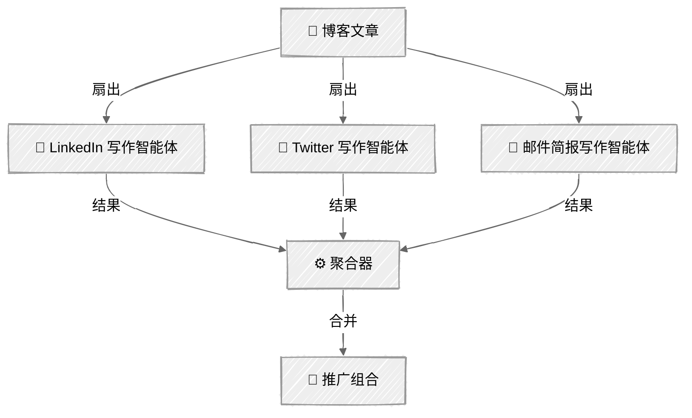
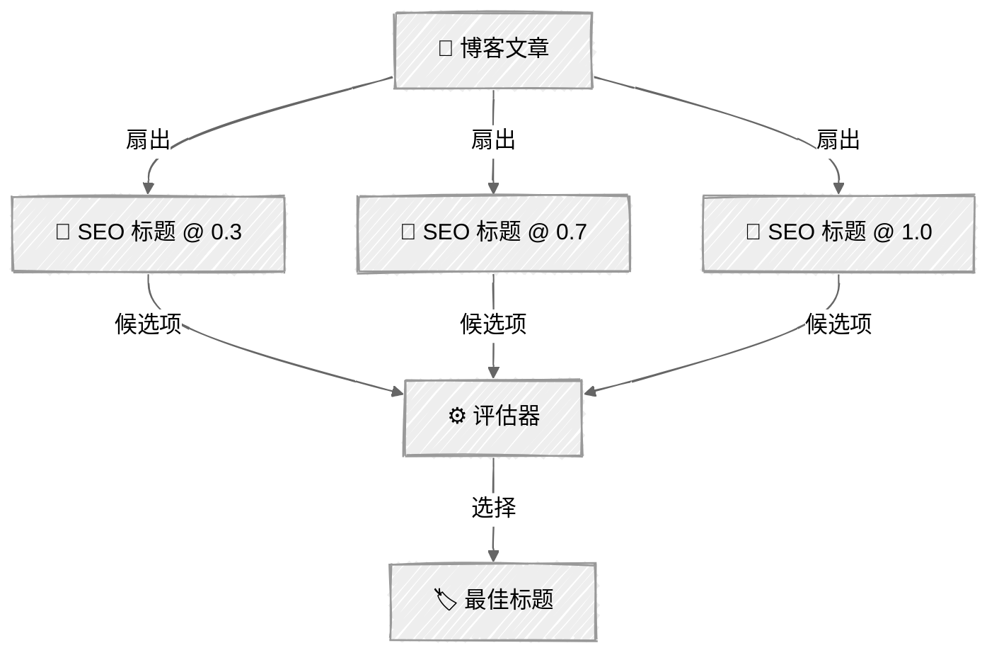

<!-- ---
title: "并行化"
description: "将工作同时扇出到多个 LLM 调用，再聚合结果"
icon: "layers"
--- -->

# 并行化——社交媒体推广组合

将独立工作扇出，再通过扇入合并。独立任务并发运行（速度更快），然后聚合为一个交付成果。任务必须真正相互独立——如果任务 B 依赖任务 A 的输出，就不要将它们并行化。

## 🎯 你将学到什么

- 使用 `ThreadPoolExecutor` 扇出相互独立的 LLM 调用
- 将并行结果聚合为一个组合输出
- 实现投票模式：以不同温度生成候选项，然后进行评估
- 使用事件回调将流水线逻辑与 UI 解耦
- 理解任务何时真正独立，何时存在依赖关系

## 📦 可用示例

| 提供商 | 文件 | 说明 |
|----------|------|-------------|
|  | [01_parallelization.py](01_parallelization.py) | 社交媒体推广组合 + SEO 标题投票 |

## 🚀 快速开始

> **前置条件：** Python 3.11+、API 密钥和 uv。完整的环境配置说明请参阅 [SETUP.md](../../SETUP.md)。

```bash
uv run --directory 02-effective-agents/03-parallelization python {script_name}

# 示例
uv run --directory 02-effective-agents/03-parallelization python 01_parallelization.py
```

也可以使用 VS Code 的 [Code Runner](https://marketplace.visualstudio.com/items?itemName=formulahendry.code-runner) 扩展，一键运行当前打开的脚本。

## 🔑 核心概念

### 扇出 / 扇入

一篇博客文章（从 `input/` 中选择或自行粘贴）会同时发送给 3 个相互独立的写作智能体：



每个写作智能体都有一个专门的系统提示词，并在独立线程中运行。各结果完成后会被收集并聚合成“推广组合”，保存到 `output/`。

### 投票模式

以不同温度（0.3、0.7、1.0）生成 3 个 SEO 标题候选项，然后使用评估器选出最佳标题：



较低的温度会生成稳妥、可预测的标题；较高的温度则会生成更有创意、更出人意料的标题。评估器从多样化的候选池中挑选最佳项——输入的变化越丰富，选出的结果就越好。

### 线程安全

Anthropic Python 客户端是线程安全的。每个 `ThreadPoolExecutor` 工作线程都会独立发起自己的 API 调用。令牌追踪采用简单的整数加法（对于此用例是安全的）。

### 事件回调

`ParallelContentGenerator` 类通过回调发出事件（`fanout_start`、`writer_complete`、`voting_start` 等），由调用方决定如何呈现进度。这样可使流水线逻辑不掺杂 UI 相关处理：

```python
def run(self, blog_post: str, on_event: GeneratorCallback | None = None) -> dict[str, str]:
```

这与 [01 - 提示链](../01-prompt-chaining/) 中展示步骤进度所用的模式相同。

## ⚠️ 重要注意事项

- 任务必须真正相互独立——如果任务 B 依赖任务 A 的输出，就不要并行化
- 并发调用越多，API 瞬时用量越高；请留意速率限制
- 应按任务处理错误：单个任务失败不应导致整个扇出流程崩溃
- 线程数应与独立任务数相匹配，不要超过它

## 👉 后续步骤

- [04 - 编排器—工作智能体](../04-orchestrator-workers/)——让 LLM 动态决定要并行处理哪些工作
- 实验：结合 `anthropic.AsyncAnthropic` 加入 `asyncio`，实现异步并行化
