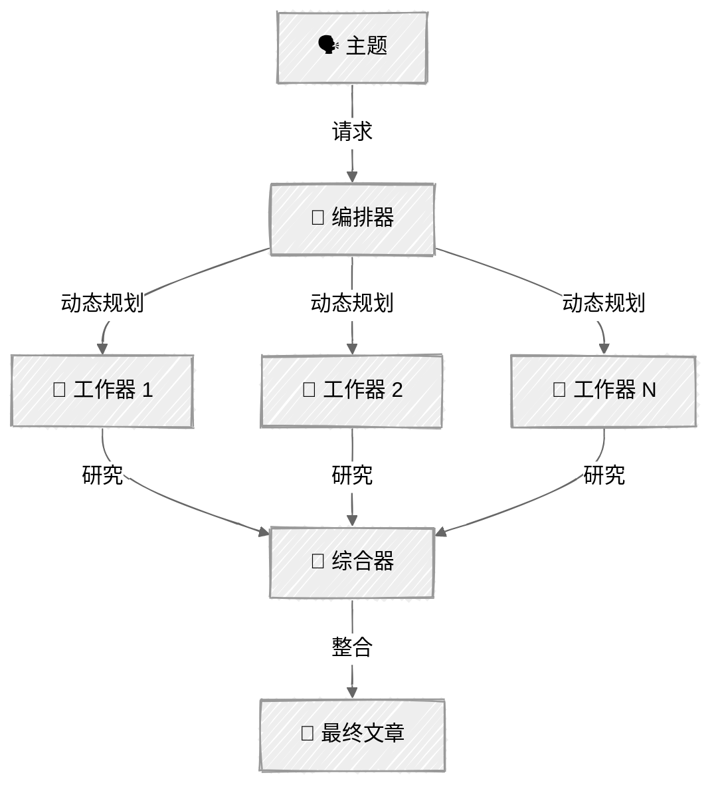

<!-- ---
title: "编排器—工作器"
description: "由中央大语言模型动态拆解任务，并将其委派给并行工作器"
icon: "network"
--- -->

# 编排器—工作器：深度研究员

一个中央大语言模型动态拆解任务，将子任务委派给工作器大语言模型，并综合它们的结果。程序员定义的是工作器的能力，而不是具体任务。

## 🎯 你将学到什么

- 使用大语言模型作为编排器，动态规划任务拆解方式
- 定义工作器的能力，同时让编排器决定具体任务
- 并行执行工作器以提高吞吐量
- 将不同方向的研究综合成连贯的最终成果

## 📦 可用示例

| 提供商 | 文件 | 说明 |
|----------|------|-------------|
|  | [01_orchestrator_workers.py](01_orchestrator_workers.py) | 能够动态规划子主题的深度研究员 |

## 🚀 快速开始

> **前置条件：** Python 3.11+、API 密钥和 uv。完整配置说明请参阅 [SETUP.md](../../SETUP.md)。

```bash
uv run --directory 02-effective-agents/04-orchestrator-workers python {script_name}

# 示例
uv run --directory 02-effective-agents/04-orchestrator-workers python 01_orchestrator_workers.py
```

也可以使用 VS Code 的 [Code Runner](https://marketplace.visualstudio.com/items?itemName=formulahendry.code-runner) 扩展，一键运行当前打开的脚本。

## 🔑 核心概念



### 动态拆解

与 [03 - 并行化](../03-parallelization/)（需要硬编码扇出任务）不同，编排器会使用大语言模型，根据输入决定要研究*哪些*子主题：

```python
tool_choice={"type": "tool", "name": "create_research_plan"}
```

“比较 Bun 与 Node.js”可能会生成以下子主题：性能、NPM 兼容性、调试、部署和社区。

### 工作器模式

工作器是通用的研究员，编排器会向它们提供具体提示词。你定义的是工作器的*能力*（深入研究某个主题），而不是具体任务。这正是它与并行化模式的关键区别：工作拆解方式由大语言模型决定。

### 综合

所有工作器完成任务后，综合器会将各自独立的研究整合成一篇衔接自然、交叉引用恰当的文章。这是一次使用专属系统提示词的独立大语言模型调用，而不只是简单拼接文本。

## ⚠️ 重要注意事项

- 编排器的规划质量决定最终输出质量
- 各工作器相互独立，无法引用彼此的研究发现
- 子主题越多，API 调用次数越多，成本也越高。建议限制为 3～5 个

## 👉 后续步骤

- [05 - 评估器—优化器](../05-evaluator-optimizer/)：添加质量反馈循环
- 尝试为工作器分配不同模型（简单主题使用快速模型，复杂主题使用能力更强的模型）
