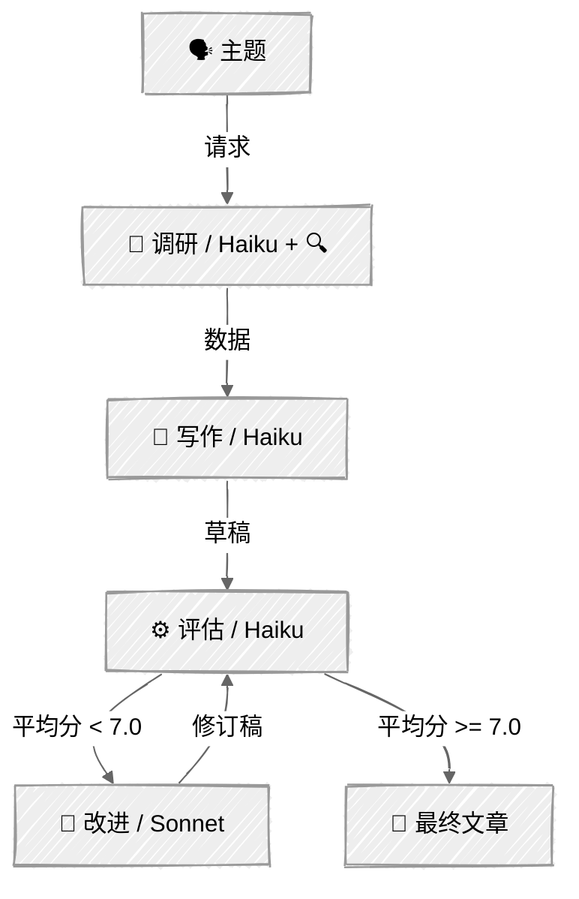

<!-- ---
title: "评估器—优化器"
description: "一个大语言模型负责生成，另一个负责评审，循环往复，直到达到质量阈值"
icon: "refresh"
--- -->

# 评估器—优化器：编辑工作台

一个大语言模型生成回答，另一个大语言模型在循环中对其进行评估和改进，直到达到质量阈值。生成器和评估器使用目标不同的提示词。

## 🎯 你将学到什么

- 使用大语言模型充当评委，按照预先定义的维度为生成内容评分
- 定义评估标准，并通过结构化工具输出强制执行这些标准
- 构建“评估 → 改进”循环，使结果逐步达到质量阈值
- 分离生成器与评估器的角色，避免目标冲突

## 📦 可用示例

| 提供商 | 文件 | 说明 |
|--------|------|------|
|  | [01_evaluator_optimizer.py](01_evaluator_optimizer.py) | 通过五维评估循环改进博客文章 |

## 🚀 快速开始

> **前置条件：** Python 3.11+、API 密钥和 uv。完整配置说明请参阅 [SETUP.md](../../SETUP.md)。

```bash
uv run --directory 02-effective-agents/05-evaluator-optimizer python {script_name}

# 示例
uv run --directory 02-effective-agents/05-evaluator-optimizer python 01_evaluator_optimizer.py
```

也可以使用 VS Code 的 [Code Runner](https://marketplace.visualstudio.com/items?itemName=formulahendry.code-runner) 扩展，单击一次即可运行当前打开的脚本。

## 🔑 核心概念



### 流水线：调研 → 写作 → 评估 → 改进

该流水线将网页搜索与写作分离，以控制令牌成本：

1. **调研**——通过网页搜索收集最新资料（Haiku + `web_search` 工具）
2. **写作**——根据调研资料进行整合，不使用工具（Haiku，仅文本）
3. **评估**——通过结构化输出进行五维评分（Haiku，`tool_choice`）
4. **改进**——结合反馈和完整草稿进行重写，不使用工具（Sonnet）

每次网页搜索会增加约 2.5 万至 3.5 万个输入令牌。将搜索限制在调研阶段，可以让写作和改进步骤保持精简。

### 关注点分离

作者、评估器和改进器的目标有本质区别：

- **作者**：根据调研资料创作有吸引力的内容
- **评估器**：依据客观标准严格评判内容质量
- **改进器**：在保持原有表达风格的同时处理具体反馈

将这些角色合并到一个提示词中会造成目标冲突。把它们分开，才能有针对性地改进内容。

### 结构化评估

从五个维度进行评分（1～10 分）：

- **清晰度**——工程师能否无需反复阅读就理解内容？
- **技术准确性**——信息是否正确且符合现状？
- **结构**——逻辑是否流畅，内容是否易于浏览？
- **吸引力**——工程师是否愿意阅读？
- **自然表达**——读起来是否像真人所写？

此外，评估器还会给出具体问题和可执行的建议，并将这些结构化反馈传给改进器。

### 收敛

平均分达到阈值（默认 7.0）或完成最大改进次数（默认 2 次）时，循环终止。大多数提升发生在第一次改进中，边际收益递减确实存在：

```python
SCORE_THRESHOLD = 7.0
MAX_REFINEMENTS = 2
```

### 令牌成本控制

每个阶段只使用自身所需的上下文，不累积聊天历史：

- **隔离高成本工具**——网页搜索只在调研阶段运行一次，其他阶段均仅处理文本
- **按需选择模型**——Haiku 负责调研、写作和评估；仅在写作质量最重要的改进阶段使用 Sonnet
- **限制输出**——结构化评估返回紧凑的 JSON，而不是大段文字

## ⚠️ 重要注意事项

- 评估器可能过于宽松或严苛，请合理校准阈值
- 评估器使用快速、低成本的 Haiku 评分；改进器使用 Sonnet 以获得更高的写作质量
- 边际收益递减：大多数提升发生在第一次改进中

## 👉 后续步骤

- [06 - 人机协同](../06-human-in-the-loop/)——在工作流中加入人工检查点
- 尝试调整 `SCORE_THRESHOLD` 和 `MAX_REFINEMENTS`，寻找质量与成本之间的平衡
- 比较包含和不包含调研阶段时的输出质量
