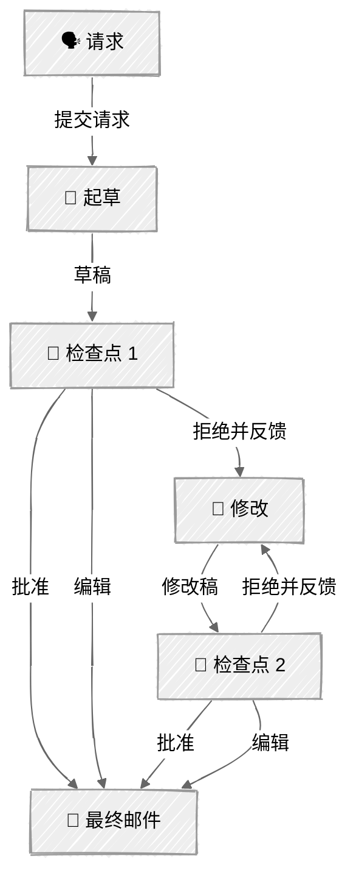

<!-- ---
title: "人在回路"
description: "在关键检查点暂停智能体工作流，以便人工审核、批准或编辑"
icon: "user-check"
--- -->

# 人在回路——审批关卡

在关键检查点暂停工作流，以便人工审核。LLM 起草邮件，人工批准或拒绝并提供反馈，随后 LLM 根据反馈修改——这个示例展示了人工监督在何处最有价值。

## 🎯 你将学到什么

- 将检查点放在错误影响最容易扩大的位置——流程前期
- 实现三种响应模式：批准、拒绝并提供反馈、直接编辑
- 将检查点函数注入智能体类，使逻辑易于测试
- 限制修改轮数，防止人与智能体之间无限往返

## 📦 可用示例

| 提供商 | 文件 | 说明 |
|--------|------|------|
|  | [01_human_in_the_loop.py](01_human_in_the_loop.py) | 带有 2 个关键检查点的邮件起草示例 |

## 🚀 快速开始

> **前置条件：** Python 3.11+、API 密钥和 uv。完整配置说明请参阅 [SETUP.md](../../SETUP.md)。

```bash
uv run --directory 02-effective-agents/06-human-in-the-loop python {script_name}

# 示例
uv run --directory 02-effective-agents/06-human-in-the-loop python 01_human_in_the_loop.py
```

也可以使用 VS Code 的 [Code Runner](https://marketplace.visualstudio.com/items?itemName=formulahendry.code-runner) 扩展，一键运行当前打开的脚本。

## 🔑 核心概念



### 检查点的设置位置

两个检查点分别位于影响程度不同的位置：

1. **草稿完成后**——影响大。在进行任何修改工作前，发现语气不当、要点缺失或意图理解错误等问题。
2. **修改完成后**——确认反馈是否得到落实。如果没有，人工可以继续提供反馈（最多修改 `MAX_REVISIONS` 轮）。

### 三种响应模式

每个检查点都提供三个选项：

- **(y) 批准**——使用当前输出继续
- **(n) 拒绝并反馈**——智能体根据你的反馈修改
- **(e) 编辑**——直接用你自己的文本替换输出

这让人工拥有完整的控制权：轻度介入（批准）、定向指导（反馈）或亲自处理（编辑）。

### 可注入的检查点函数

`CheckpointFn` 类型让智能体易于测试和适配：

```python
CheckpointFn = Callable[[str, str, str], tuple[bool, str]]
```

- 在终端中：`human_checkpoint()` 通过 Rich 界面请求输入
- 在测试中：传入自动批准的 lambda
- 在生产环境中：替换为 Slack 消息、Webhook 或界面模态框

### 杠杆原则

越早设置检查点，杠杆效应越大。在检查点 1 发现语气错误，可以省去后续所有无效修改；在检查点 2 才发现错别字，则无法节省任何前期工作。设计检查点时应追求最大程度地预防错误，而不是覆盖尽可能多的环节。

## ⚠️ 重要注意事项

- 检查点过多 = 所有工作都由人工完成（违背使用智能体的初衷）
- 检查点过少 = 智能体可能犯下无法挽回的错误
- 在生产环境中，检查点通常是异步的——例如 Slack 消息、界面审批或 Webhook——而不是终端输入
- 限制修改轮数（`MAX_REVISIONS`），避免成本无限增长

## 👉 后续步骤

- [07 - 内容写作智能体](../07-content-writer/)——将所有模式组合成一个生产级内容创作智能体
- 实验：增加置信度评分，自动批准高置信度草稿
- 尝试将 `human_checkpoint` 替换为记录到文件的函数（模拟异步审核）
