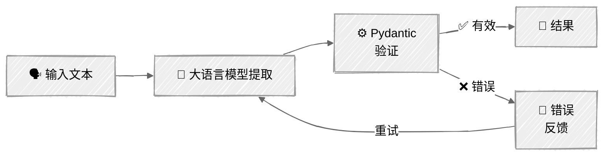

<!-- ---
title: "结构化输出与验证"
description: "从大语言模型中提取可靠、带类型数据的生产级技术"
icon: "code"
--- -->

# 结构化输出与验证

从大语言模型获取经过验证、带类型且可安全用于生产环境的数据，并妥善处理出错情况。本教程以真实的客服工单分析场景为例，介绍四种从基础到稳健的技术。

> **前置知识：** [02 - 提示词工程](../../01-foundations/02-prompt-engineering/)介绍了基本的 JSON 提取方式（基于提示词、XML 预填充和原生模式）。本教程将进一步讲解 Pydantic 集成、复杂嵌套模式、验证重试循环和批量提取。

## 🎯 你将学到什么

- 使用 **tool_use 生成结构化输出**，处理简单和复杂模式（成熟的常用方案）
- 使用**原生约束解码**保证 JSON 有效（Anthropic `output_config`）
- 通过“验证 + 错误反馈重试”循环构建**自修复提取流程**
- 通过一次 API 调用**批量处理多个项目**
- 比较 **Anthropic 与 OpenAI** 的实现方式：底层机制不同，目标相同

## 📦 示例

| 提供商 | 脚本 | 说明 |
|--------|------|------|
|  | [01_structured_output_anthropic.py](01_structured_output_anthropic.py) | 4 种技术：tool_use、原生模式、验证与重试、批量处理 |
|  | [02_structured_output_openai.py](02_structured_output_openai.py) | OpenAI 对比示例：使用严格模式的 `text.format`（简单模式 + 复杂模式） |

## 🚀 快速开始

> **准备工作：** 请先按照 [SETUP.md](../../SETUP.md) 配置 API 密钥和环境。

```bash
# Anthropic（主要示例，共 4 种技术）
uv run --directory 03-advanced-techniques/01-structured-output 01_structured_output_anthropic.py

# OpenAI（对比示例，使用不同机制）
uv run --directory 03-advanced-techniques/01-structured-output 02_structured_output_openai.py
```

两个脚本都使用交互式菜单，请选择一种技术查看实际效果。

## 🔑 核心概念

### 问题：从文本到类型

大语言模型生成的是文本，而应用程序需要的是带类型的数据，例如枚举、嵌套对象和经过验证的字段。结构化输出技术所要解决的，正是“生成近似 JSON 的文本”与“返回经过验证的 `TicketAnalysis` 对象”之间的差距。

### 技术 1：将工具调用用作结构化输出

这是生产环境中应用最广泛的模式。定义一个“工具”，以所需的输出模式作为其 `input_schema`，然后强制模型调用该工具。它既适用于简单的扁平模式，也适用于复杂的嵌套结构：

```python
# 使用 model.model_json_schema() 生成模式，不要手写
tool = {
    "name": "classify_ticket",
    "description": "对客服工单进行分类。",
    "input_schema": TicketClassification.model_json_schema(),
}
response = client.messages.create(
    tools=[tool],
    tool_choice={"type": "tool", "name": "classify_ticket"},  # 强制调用该工具
    messages=[...],
)
# 工具输入就是所需的结构化输出
result = TicketClassification(**block.input)
```

同一模式可以扩展到复杂的嵌套模式，Pydantic 会处理嵌套、枚举和可选字段：

```python
class TicketAnalysis(BaseModel):
    classification: TicketClassification    # 嵌套模型
    entities: list[Entity]                  # 对象列表
    action_items: list[ActionItem]          # 另一个列表
    requires_escalation: bool
    escalation_reason: str | None = None    # 可选字段

# 一行代码即可生成完整的 JSON Schema
tool = {
    "name": "analyze_ticket",
    "input_schema": TicketAnalysis.model_json_schema(),
}
```

**适用场景：** 适用于所有模型版本，支持广泛，并且经过了生产环境的充分检验。

### 技术 2：原生结构化输出（约束解码）

Anthropic 的原生方案从根本上阻止模型生成无效 JSON：

```python
response = client.beta.messages.parse(
    output_config={"format": TicketClassification},  # Pydantic 模型
    messages=[...],
)
result = response.parsed_output  # 已经是通过验证的 Pydantic 实例
```

**适用场景：** 需要零重试即可保证有效性时。这是现有方案中最可靠的选择。

### 技术 3：验证与重试（自修复）

对于 JSON Schema 无法表达的业务规则，可使用 Pydantic 验证，并将错误反馈给大语言模型：

```python
class TicketAnalysis(BaseModel):
    requires_escalation: bool
    escalation_reason: str | None = None

    @model_validator(mode="after")
    def check_escalation(self) -> "TicketAnalysis":
        if self.requires_escalation and not self.escalation_reason:
            raise ValueError("需要升级处理时，必须提供 escalation_reason")
        return self
```

重试循环：提取 → 验证 → 出错时反馈验证信息 → 重试。



### 技术 4：批量提取

在一次调用中处理多个项目，这在数据管道中十分常见：

```python
class TicketBatch(BaseModel):
    analyses: list[TicketAnalysis]
    batch_summary: str
    priority_distribution: dict[str, int]
```

**权衡：** 单次调用成本更低，但处理大批量数据时可靠性也较低。一次处理 3～10 个项目效果较好；超过此数量时，建议并行调用并逐项处理。

### Anthropic 与 OpenAI：目标相同，API 接口不同

| 方面 | Anthropic | OpenAI |
|------|-----------|--------|
| **约束解码** | `output_config={"format": Model}` | 使用严格模式的 `text.format` |
| **基于工具的提取** | `tool_use` + `tool_choice` | 同样支持 |
| **Pydantic 集成** | 直接传入模型 | 需要模式转换辅助函数 |
| **严格模式要求** | 无 | 所有层级均需设置 `additionalProperties: false` |
| **可靠性** | 有保证（两种方式均可） | 有保证（严格模式） |

两者都使用约束解码来保证 JSON 有效；区别在于 API 接口，而非机制或可靠性。

## ⚠️ 重要注意事项

- **模式设计很重要：** 扁平模式比深层嵌套模式更可靠。分类字段应优先使用枚举，而非自由文本。描述应保持简洁。
- **可选字段需要默认值：** 可选字段应始终设置 `= None`。模型处理显式默认值的效果优于隐式默认值。
- **超越模式的验证：** JSON Schema 验证结构，Pydantic `@model_validator` 验证业务规则。两者应结合使用。
- **关注成本：** 原生模式和 tool_use 只增加少量开销。验证重试会成倍增加 token 成本，因此应将重试次数限制为 2～3 次。
- **批量限制：** 单次调用批量提取适合处理 3～10 个项目。超过此数量时，并行逐项调用更可靠。

## 👉 后续步骤

- **[02 - 流式传输](../02-streaming/)**：为智能体添加实时、逐 token 输出
- **动手实验：** 尝试修改 `TicketAnalysis` 模式，例如添加字段、更改枚举或增加 `@model_validator` 规则
- **挑战：** 构建一个多步骤管道：先对工单进行分类（技术 1 的简单模式），仅对高优先级工单提取完整分析（技术 1 的复杂模式）
