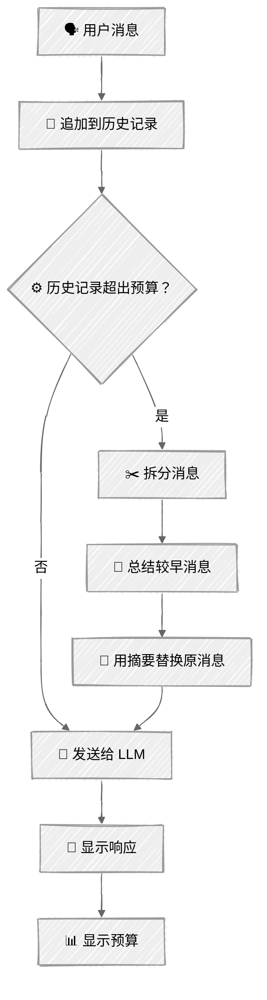

<!-- ---
title: "上下文工程"
description: "通过令牌计数、预算分配和自动压缩来管理有限的上下文窗口"
icon: "layers"
--- -->

# 上下文工程

每段对话都有上限。[聊天教程](../../01-foundations/03-chat/)介绍了基本模式——追加消息，然后将全部消息发送出去。这种方式会一直有效，直到触及上下文窗口上限。本教程将加入工程化能力：测量令牌数、分配预算，并在空间即将耗尽时自动压缩上下文。

关键认识：上下文工程并不是要把更多内容硬塞进去，而是要判断什么最重要，并把它保留下来。

## 🎯 你将学到什么

- 在发送请求前，使用 `client.messages.count_tokens()` 精确计算令牌数
- 在系统提示词、对话历史和响应预留空间之间分配上下文预算
- 实现“滑动窗口 + 摘要”机制，自动压缩较早的消息
- 通过预算面板实时展示上下文用量
- 理解不同压缩策略之间的取舍

## 📦 可用示例

| 提供商                                          | 文件                                                                       | 说明                                      |
| ----------------------------------------------- | -------------------------------------------------------------------------- | ----------------------------------------- |
|  | [01_context_engineering_anthropic.py](01_context_engineering_anthropic.py) | 带预算管理功能的交互式聊天                |
|  | [02_tool_context_anthropic.py](02_tool_context_anthropic.py)               | 工具输出上下文策略（原样/截断/摘要）      |

## 🚀 快速开始

> **前置条件：** Python 3.11+、API 密钥和 uv。完整配置说明请参阅 [SETUP.md](../../SETUP.md)。

```bash
uv run --directory 03-advanced-techniques/03-context-engineering python 01_context_engineering_anthropic.py
```

也可以使用 VS Code 的 [Code Runner](https://marketplace.visualstudio.com/items?itemName=formulahendry.code-runner) 扩展，一键运行当前打开的脚本。

该演示会人为设置一个很小的上下文预算（约 2,000 个令牌用于历史记录），因此只需几轮对话就能看到压缩被触发。你可以讨论任何话题——每轮结束后，预算面板都会更新。

## 🔑 核心概念

### 1. 令牌计数

要管理预算，首先必须进行测量。Anthropic 提供了精确的令牌计数 API：

```python
result = client.messages.count_tokens(
    model="claude-sonnet-4-6",
    system="你是一名研究助理。",
    messages=messages,
)
print(result.input_tokens)  # 此次请求的精确令牌数
```

它使用与 API 相同的方式计算令牌，其中也包括消息格式带来的额外开销。可以在发送请求前用它进行预检。

### 2. 预算分配

上下文窗口并不是一个单一的空间池，而是由几个相互争夺空间的部分组成：

```
┌─────────────────────────────────────────────────────────┐
│                       上下文窗口                        │
│                                                         │
│  ┌──────────┐  ┌─────────────────────┐  ┌───────────┐  │
│  │  系统    │  │      对话           │  │   响应    │  │
│  │  提示词  │  │      历史           │  │ 预留空间  │  │
│  │ （固定） │  │    （可调整）       │  │ （固定）  │  │
│  └──────────┘  └─────────────────────┘  └───────────┘  │
│                                                         │
│  只测量一次       ← 你要管理的部分 →     = max_tokens  │
└─────────────────────────────────────────────────────────┘
```

```python
@dataclass
class ContextBudget:
    max_context: int          # 窗口总大小
    system_tokens: int = 0    # 初始化时测量
    response_reserve: int = 2048  # 响应的 max_tokens

    @property
    def history_budget(self) -> int:
        return self.max_context - self.system_tokens - self.response_reserve
```

系统提示词是固定的，因此只需在启动时测量一次。响应预留空间就是 `max_tokens` 参数。剩下的全部空间就是历史记录预算。

### 3. 压缩策略：滑动窗口 + 摘要

当历史记录超出预算时，对其进行压缩：

```
压缩前（超出预算）：
┌─────────────────────────────────────────────┐
│ 消息1  消息2  消息3  消息4  消息5  消息6  消息7 │  ← 5000 个令牌
└─────────────────────────────────────────────┘

拆分为较早消息和近期消息：
┌─────────────────────┐ ┌───────────────┐
│ 消息1  消息2  消息3 │ │ 消息6  消息7 │  ← 近期内容保留原文
└─────────────────────┘ └───────────────┘
         │
         ▼ 由 LLM 生成摘要
┌─────────────┐
│    摘要     │  ← 压缩到约 200 个令牌
└─────────────┘

压缩后（预算以内）：
┌─────────────┐ ┌───────────────┐
│    摘要     │ │ 消息6  消息7 │  ← 1500 个令牌
└─────────────┘ └───────────────┘
```

摘要会保留关键事实和决策。近期消息则保留原文，让模型能够完整掌握最新上下文。

### 4. 压缩流程

<!-- prettier-ignore -->


### 5. 为什么使用摘要而不是直接丢弃？

| 策略             | 优点               | 缺点                       |
| ---------------- | ------------------ | -------------------------- |
| **丢弃最早消息** | 简单、可预测       | 永久丢失上下文             |
| **截断**         | 不需要额外 API 调用 | 可能从句子中间截断并丢失含义 |
| **摘要**         | 保留关键事实       | 需要额外调用一次 API       |

摘要通常是最佳默认方案——模型只需使用一小部分令牌，就能继续了解较早讨论过的主题。代价是每次压缩都要额外调用一次 API，但为了保持对话质量，这通常是值得的。

### 6. 上下文窗口大小

以下是部分 Claude 模型的上下文窗口大小，供参考：

| 模型              | 上下文窗口      | 说明                       |
| ----------------- | --------------- | -------------------------- |
| Claude Opus 4     | 20 万个令牌     | 能力最强，上下文窗口最大   |
| Claude Sonnet 4.5 | 20 万个令牌     | 性能与成本较为均衡         |
| Claude Haiku 3.5  | 20 万个令牌     | 速度最快、成本效益最高     |

在生产环境中，预算通常应设置为接近模型的实际上限。本教程使用 4K 预算，以便快速直观地看到压缩效果。

### 7. 工具输出策略

在智能体系统中，工具输出是消耗上下文最多的部分——一次 CRM 查询或产品搜索就可能返回超过 1,000 个令牌的 JSON。脚本 02 演示了三种管理方式：

```
原始工具输出（约 1500 个令牌）：
┌──────────────────────────────────┐
│ { "orders": [ { "id": "ORD-9001", │
│   "items": [ ... ], "total": ... │
│   }, { "id": "ORD-8744", ...     │
│   }, ... 另外 6 个订单 ...          │
│ ] }                              │
└──────────────────────────────────┘
   │               │               │
   ▼               ▼               ▼
 原样注入         截断            摘要
               （限制字符数）  （由 LLM 提取）
 1500 令牌       约 150 令牌      约 200 令牌
```

| 策略         | 工作方式                                  | 成本                       | 风险                               |
| ------------ | ----------------------------------------- | -------------------------- | ---------------------------------- |
| **原样注入** | 直接注入原始 JSON                         | 无                         | 2～3 次调用就会填满上下文          |
| **截断**     | 限制为 N 个字符，并附加 `[已截断]`       | 无                         | 丢失末尾数据，可能截掉关键信息     |
| **摘要**     | 由 LLM 将关键事实提取为项目符号列表       | 每次使用工具多调用一次 API | 消耗令牌，但能保留含义             |

```python
def _process_tool_result(self, tool_name: str, raw_result: str) -> str:
    """将工具输出注入上下文前，应用所选策略。"""
    if self.strategy == "naive":
        return raw_result
    if self.strategy == "truncate":
        return self._truncate_result(raw_result)
    if self.strategy == "summarize":
        return self._summarize_result(tool_name, raw_result)
```

摘要策略会使用针对性很强的系统提示词，只提取相关事实：

```python
def _summarize_result(self, tool_name: str, result: str) -> str:
    response = self.client.messages.create(
        model=self.model,
        max_tokens=512,
        system="从这份工具输出中提取关键事实，并生成简洁摘要。"
               "保留所有姓名、ID、数字、日期和状态。",
        messages=[{"role": "user", "content": f"工具：{tool_name}\n\n输出：\n{result}"}],
    )
    return response.content[0].text
```

## 🏗️ 代码结构

### 脚本 01——聊天上下文（ContextManager）

```python
class ContextManager:
    """管理上下文窗口分配和对话压缩。"""

    def chat(self, user_input: str) -> str:
        """追加消息 → 按需压缩 → 发送 → 返回响应。"""

    def _count_tokens(self, messages: list[dict]) -> int:
        """通过 count_tokens API 在发送前测量令牌数。"""

    def _compress_if_needed(self) -> None:
        """拆分较早/近期消息 → 总结较早消息 → 进行替换。"""

    def _summarize_messages(self, messages: list[dict]) -> str:
        """使用 LLM 对消息块生成摘要。"""

    def get_token_snapshot(self) -> TokenSnapshot:
        """获取当前预算状态，用于可视化。"""
```

### 脚本 02——工具输出上下文（ToolContextAgent）

```python
class ToolContextAgent:
    """演示工具输出上下文管理策略的智能体。"""

    def chat(self, user_input: str) -> str:
        """智能体循环：发送 → 检测工具调用 → 执行 → 处理结果 → 继续循环。"""

    def _process_tool_result(self, tool_name: str, raw_result: str) -> str:
        """将工具输出注入上下文前，应用所选策略。"""

    def _truncate_result(self, result: str) -> str:
        """限制为 TRUNCATE_MAX_CHARS 个字符，并添加截断标记。"""

    def _summarize_result(self, tool_name: str, result: str) -> str:
        """调用 LLM 从工具输出中提取关键事实。"""

    def _count_tokens(self, messages: list[dict]) -> int:
        """通过 count_tokens API 在发送前测量令牌数。"""

    def _compress_if_needed(self) -> None:
        """拆分较早/近期消息 → 总结较早消息 → 进行替换。"""

    def get_token_snapshot(self) -> TokenSnapshot:
        """获取预算状态，用于可视化。"""
```

## ⚠️ 重要注意事项

- **令牌计数成本**——`count_tokens()` 是一种轻量级 API 调用，但仍会产生延迟。在生产环境中，可以考虑缓存计数结果，或在非关键检查中使用 tiktoken 进行估算。
- **摘要质量**——摘要本质上是一种有损压缩，细节可能会丢失。如果对话中的每个细节都很重要，可以考虑使用更大的上下文窗口或外部记忆。
- **消息角色交替**——Anthropic API 要求用户和助手消息交替出现。插入摘要（作为用户消息）后，可能需要先添加一条助手确认消息，再添加下一条用户消息。
- **级联压缩**——经过多次压缩后，摘要本身也可能变得很长，此时可能需要再次生成摘要。由于本实现会在每一轮检查预算，因此能够自然处理这种情况。
- **人为设置的预算**——演示中的 8K 预算刻意设置得很小。在使用 Claude 20 万令牌上下文窗口的生产系统中，压缩频率会低得多。

## 👉 后续步骤

掌握上下文工程后，可以继续：

- **[成本优化](../04-cost-optimization/)**——通过提示词缓存和智能模型路由降低 API 成本
- **动手实验**——尝试修改 `RECENT_MESSAGES_TO_KEEP` 和 `MAX_CONTEXT_TOKENS`，观察它们对压缩行为的影响
- **深入探索**——添加一个显示当前摘要的 `recall` 命令，或者尝试使用不同的摘要提示词
