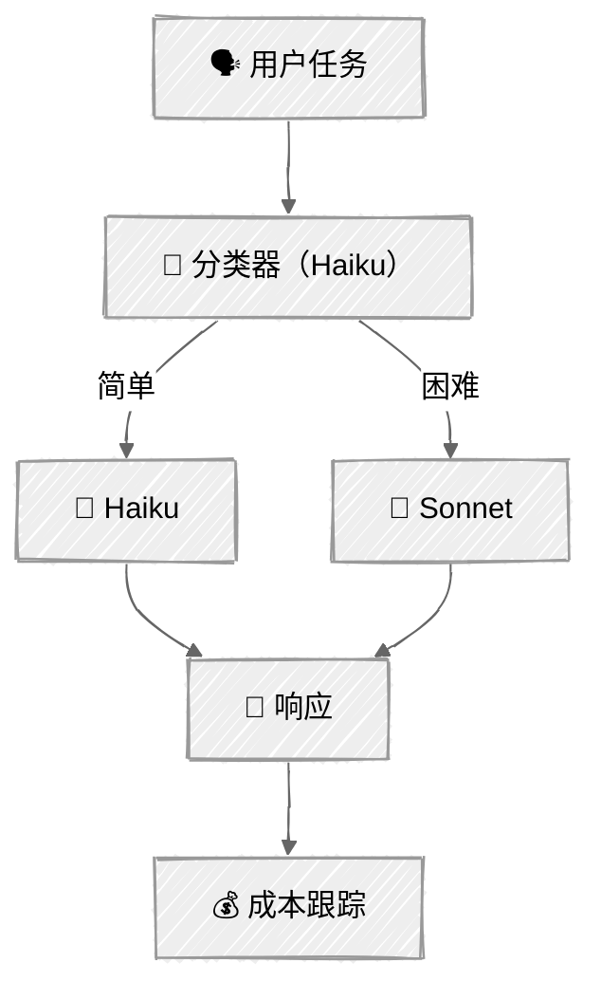

<!-- ---
title: "成本优化"
description: "通过提示词缓存和智能模型路由降低 API 成本"
icon: "zap"
--- -->

# 成本优化

[上下文工程教程](../03-context-engineering/)介绍了如何管理上下文窗口中可以容纳的*内容*。本教程解决另一个问题：降低所发送内容的*成本*。这里采用两种互补策略——缓存重复内容以降低重复付费，并将任务路由到能够胜任的最便宜模型。

## 🎯 你将学到什么

- 使用明确的缓存断点组织系统提示词，以利用 Anthropic 的提示词缓存
- 理解缓存未命中（MISS）与命中（HIT）的机制，以及 5 分钟的生存时间（TTL）
- 跟踪缓存指标，并通过分析计算实际节省的成本
- 构建一个使用低成本模型判断任务难度的模型路由器
- 根据复杂度将任务路由到 Haiku（简单）或 Sonnet（困难）
- 将路由成本与全部使用 Sonnet 的基准方案进行比较

## 📦 可用示例

| 提供商 | 文件 | 说明 |
| --- | --- | --- |
|  | [01_prompt_caching_anthropic.py](01_prompt_caching_anthropic.py) | 使用缓存策略文档的客户支持智能体 |
|  | [02_model_routing_anthropic.py](02_model_routing_anthropic.py) | 基于难度的路由（Haiku 与 Sonnet） |

## 🚀 快速开始

> **前置条件：** Python 3.11+、API 密钥和 uv。完整安装说明请参阅 [SETUP.md](../../SETUP.md)。

```bash
# 提示词缓存演示
uv run --directory 03-advanced-techniques/04-cost-optimization python 01_prompt_caching_anthropic.py

# 模型路由演示
uv run --directory 03-advanced-techniques/04-cost-optimization python 02_model_routing_anthropic.py
```

也可以使用 VS Code 的 [Code Runner](https://marketplace.visualstudio.com/items?itemName=formulahendry.code-runner) 扩展，单击即可运行当前打开的脚本。

## 🔑 核心概念

### 1. 提示词缓存的工作原理

Anthropic 会缓存提示词的*前缀*。第一次调用会写入缓存（需支付少量溢价）；之后使用相同前缀的调用会读取缓存，节省 90% 的费用。

```
调用 1 — 缓存未命中：
┌────────────────────────────────┐
│  系统：指令 + 策略             │ ──→ 写入缓存（1.25 倍成本）
│  用户：“退货政策是什么？”       │
└────────────────────────────────┘

调用 2 — 缓存命中：
┌────────────────────────────────┐
│  系统：指令 + 策略             │ ──→ 从缓存读取（0.1 倍成本！）
│  用户：“配送需要多长时间？”     │
└────────────────────────────────┘
```

缓存的 TTL 为 5 分钟，每次命中都会刷新。只要持续发出请求，缓存就会保持热状态。

### 2. 缓存感知的提示词设计

按以下方式组织系统提示词，可以最大限度地复用缓存：

| 规则 | 原因 |
| --- | --- |
| **静态内容在前** | 缓存基于前缀——把策略、指令等稳定内容放在开头 |
| **动态内容在后** | 缓存前缀之后的所有内容均按全价计费 |
| **超过最低词元数** | Sonnet 要求缓存块不少于 1024 个词元；Haiku 要求不少于 2048 个 |
| **使用明确的断点** | `cache_control: {"type": "ephemeral"}` 可以精确控制缓存哪些内容 |
| **留意 TTL** | 缓存窗口为 5 分钟——只有请求足够频繁时，缓存才有帮助 |

```python
# 在系统提示词块上设置明确的缓存断点
system = [
    {"type": "text", "text": "简短指令……"},
    {
        "type": "text",
        "text": large_policy_document,   # 1500+ 个词元
        "cache_control": {"type": "ephemeral"},
    },
]
```

### 3. 读取缓存指标

Anthropic 的每个响应都会在 `usage` 对象中包含缓存词元计数：

```python
response = client.messages.create(model=model, system=system, messages=messages)

usage = response.usage
print(usage.input_tokens)                  # 输入词元总数
print(usage.cache_creation_input_tokens)   # 写入缓存的词元数（未命中）
print(usage.cache_read_input_tokens)       # 从缓存读取的词元数（命中）
```

第一次调用时，`cache_creation_input_tokens > 0`。后续使用相同前缀的调用中，`cache_read_input_tokens > 0`——这正是节省 90% 费用的来源。

### 4. 缓存何时会适得其反

| 反模式 | 问题 |
| --- | --- |
| 每次调用的提示词都不同 | 支付了 1.25 倍的写入溢价，却从未命中缓存 |
| 系统提示词少于 1024 个词元 | 低于最低要求——Sonnet 完全不会缓存 |
| 请求间隔超过 5 分钟 | 缓存在调用之间过期，导致每次调用都是写入操作 |
| 动态内容位于静态内容之前 | 破坏前缀——动态部分之后的内容无法匹配缓存 |

### 5. 模型路由

并非每项任务都需要能力最强（同时也是最昂贵）的模型。路由层会对每项任务进行分类，并将其发送给合适的模型：

<!-- prettier-ignore -->


分类器本身运行在低成本的 Haiku 上，只会增加很少的开销。即使计入分类成本，将简单任务路由到 Haiku，相比所有任务都发送给 Sonnet 仍能显著节省费用。

### 6. 成本比较

| 模型 | 输入（美元/百万词元） | 输出（美元/百万词元） | 最适合 |
| --- | --- | --- | --- |
| Haiku 4.5 | $1.00 | $5.00 | 事实查询、简单数学、分类 |
| Sonnet 4.5 | $3.00 | $15.00 | 分析、设计、多步推理 |

Haiku 的输入成本比 Sonnet **低 67%**。对于简单任务占比达到 50% 以上的工作负载，路由可以大幅降低成本。

## 🏗️ 代码结构

### 脚本 01——提示词缓存（CachedSupportAgent）

```python
class CachedSupportAgent:
    """演示提示词缓存的客户支持智能体。"""

    def _build_system(self) -> str | list[dict]:
        """构建包含 cache_control 块或纯字符串的系统提示词。"""

    def chat(self, user_input: str) -> tuple[str, dict]:
        """发送消息、跟踪缓存指标并返回（响应, 用量字典）。"""

@dataclass
class CacheMetrics:
    """跟踪多次 API 调用的缓存性能。"""

    def record_call(...) -> None: ...
    def cost_with_caching(self) -> float: ...
    def cost_without_caching(self) -> float: ...     # 所有词元均按基础输入费率计算
    def savings(self) -> float: ...
    def cache_hit_rate(self) -> float: ...
```

### 脚本 02——模型路由（ModelRouter）

```python
class ModelRouter:
    """根据复杂度将任务路由到合适的模型。"""

    def classify(self, task: str) -> str:
        """Haiku 将任务分类为 'easy' 或 'hard'。"""

    def execute(self, task: str, model: str) -> tuple[str, int, int]:
        """在指定模型上运行任务。"""

    def route_and_execute(self, task: str) -> TaskResult:
        """分类 → 路由 → 执行 → 跟踪成本。"""

    def get_summary(self) -> dict:
        """汇总总路由成本、基准成本和节省金额。"""
```

## ⚠️ 重要注意事项

- **缓存 TTL**——Anthropic 的提示词缓存 TTL 为 5 分钟。只有在该时间窗口内发出多个请求时，缓存才有帮助。每次缓存命中都会刷新计时器。
- **写入溢价**——第一次调用对缓存词元按 1.25 倍收费。至少需要 4 次缓存命中才能抵消写入成本（因为读取费率为 0.1 倍）。
- **无法“取消缓存”**——内容在服务端缓存后，无法强制使缓存未命中。脚本通过将所有词元按基础输入费率计算，分析得出“未使用缓存时的成本”。
- **路由准确性**——分类器并不完美。偶尔误将困难任务路由到 Haiku，可能导致响应质量下降。在生产环境中应添加置信度阈值或回退逻辑。
- **价格变化**——词元价格以常量形式硬编码。请查看 Anthropic 的价格页面了解当前费率。
- **最低词元数阈值**——缓存断点要求达到最低词元数（Sonnet 为 1024，Haiku 为 2048）。低于阈值时会静默跳过缓存。

## 👉 后续步骤

完成成本优化示例后，可以继续：

- **[记忆系统](../05-memory/)**——让智能体拥有跨会话的持久记忆
- **实验**——尝试组合两种策略：既缓存系统提示词，又将任务路由到不同模型
- **探索**——添加第三个路由层级（例如将最困难的任务交给 Opus），或实现基于置信度的回退
