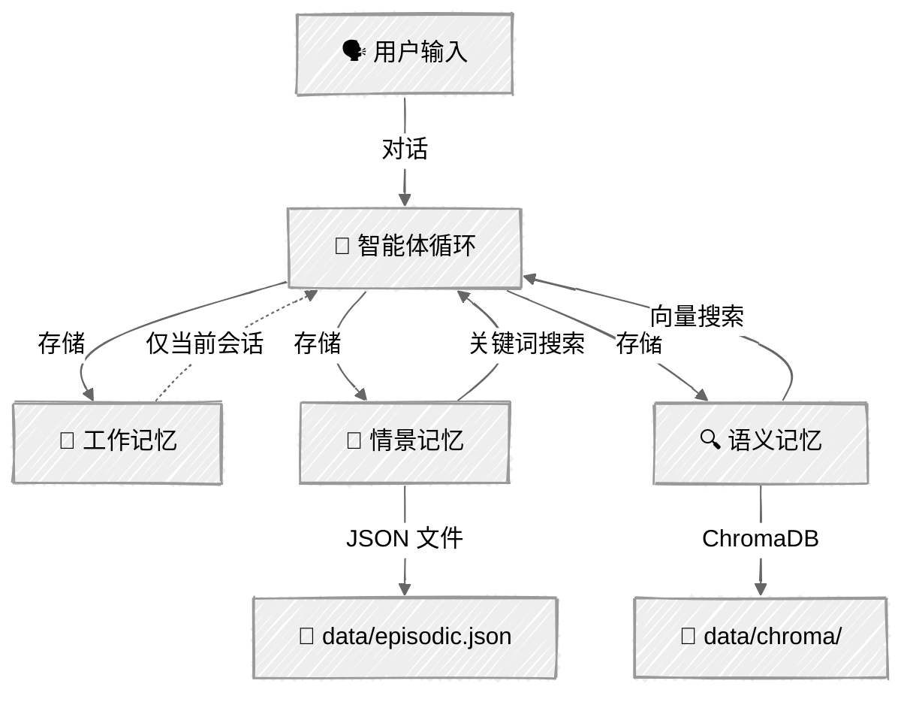

<!-- ---
title: "记忆系统"
description: "让智能体拥有持久记忆——跨会话保留工作缓冲区、情景事件和语义知识"
icon: "database"
--- -->

# 记忆系统

让智能体拥有跨会话持久存在的记忆。本教程以[上下文工程](../03-context-engineering/)（管理单个会话的上下文窗口）为基础，进一步加入**持久化**——让智能体记住你是谁、你告诉过它什么，以及之前的对话中发生过什么。

你将实现一种受人类认知启发的三层记忆架构：工作记忆（短期缓冲区）、情景记忆（带时间戳的事件）和语义记忆（向量数据库中的事实与知识）。

## 🎯 你将学到

- 区分工作记忆、情景记忆和语义记忆层
- 为会话状态构建基于重要性的淘汰缓冲区
- 将带时间戳的事件持久化到 JSON 文件，并支持关键词搜索
- 使用 ChromaDB 内置的嵌入和余弦相似度存储与检索事实
- 使用排名结果协调跨层记忆搜索
- 将回忆起的记忆注入系统提示词，生成感知上下文的回复
- 使用 LLM 提取信息，将对话整合到长期记忆中

## 📦 可用示例

| 提供方                                        | 文件                                                                           | 说明                         |
| --------------------------------------------- | ------------------------------------------------------------------------------ | ---------------------------- |
|  | [01_memory_agent_anthropic.py](01_memory_agent_anthropic.py)                   | 具备分层记忆的个人助手       |
|  | [02_memory_inspector_anthropic.py](02_memory_inspector_anthropic.py)           | 记忆浏览器/检查器（不调用 LLM） |

## 🚀 快速开始

> **前置条件：**Python 3.11+、API 密钥和 uv。完整设置说明请参阅 [SETUP.md](../../SETUP.md)。

```bash
# 记忆智能体——聊天并建立持久记忆
uv run --directory 03-advanced-techniques/05-memory python 01_memory_agent_anthropic.py

# 记忆检查器——浏览和管理已存储的记忆
uv run --directory 03-advanced-techniques/05-memory python 02_memory_inspector_anthropic.py
```

也可以使用 VS Code 的 [Code Runner](https://marketplace.visualstudio.com/items?itemName=formulahendry.code-runner) 扩展，单击即可运行当前打开的脚本。

## 🔑 核心概念

### 1. 三层记忆架构

智能体需要不同类型的记忆来满足不同用途——就像人类会区分当前正在思考的内容、最近发生的事情和已知事实一样。



| 层级 | 用途 | 存储 | 生存期 | 搜索 |
|------|------|------|--------|------|
| **工作记忆** | 当前会话上下文 | 内存列表 | 当前会话 | 直接访问 |
| **情景记忆** | 事件和互动 | JSON 文件 | 永久 | 关键词匹配 |
| **语义记忆** | 事实和知识 | ChromaDB 向量 | 永久 | 余弦相似度 |

### 2. 记忆生命周期

每条记忆都会经历一个可预测的生命周期：

**捕获** → 智能体决定某些内容值得记住（通过工具调用或整合）

**存储** → 根据内容类型路由到合适的记忆层

**检索** → 跨层搜索结合关键词和向量结果，按 `相似度 × 重要性` 排名

**整合** → 会话结束时，LLM 从对话中提取重要项目并存入持久存储

**遗忘** → 通过工具调用显式删除，或在缓冲区已满时淘汰工作记忆

### 3. 情景记忆与语义记忆

**情景记忆**存储*发生过什么*——带时间戳的事件：

```python
# “用户告诉我他叫小明”——一个曾经发生的事件
episodic.save(MemoryEntry(
    content="用户介绍自己叫小明，在示例公司工作",
    importance=0.8,
))

# 关键词搜索——查找包含匹配词的条目
results = episodic.search("小明")  # 返回匹配的 MemoryEntry 对象
```

**语义记忆**存储*已知内容*——事实和偏好：

```python
# “小明更喜欢 Python”——这是事实，而不是事件
semantic.save(MemoryEntry(
    content="用户在后端开发中更喜欢 Python，而不是 JavaScript",
    importance=0.7,
))

# 向量搜索——即使用词不同，也能找到语义相似的条目
results = semantic.search("编程语言偏好")
# 返回 [(MemoryEntry, similarity_score), ...]
```

### 4. 记忆增强提示词

关键模式：将回忆起的记忆注入系统提示词，让 LLM 在用户开口之前就拥有相关上下文。

```python
def _build_system_prompt(self) -> str:
    """将回忆起的记忆注入系统提示词。"""
    memory_context = self.memory.build_memory_context()
    return SYSTEM_PROMPT.format(memory_context=memory_context)
```

`build_memory_context()` 方法会检索最近的情景事件和最重要的语义事实，并将其格式化为 LLM 可以自然引用的 Markdown 章节。

### 5. 智能体驱动的记忆（三个工具）

不要硬编码决定何时保存记忆，而是为智能体提供**工具**，让它自行决定：

```python
MEMORY_TOOLS = [
    {"name": "remember", ...},  # 将记忆连同重要性分数存入任意层
    {"name": "recall", ...},    # 根据查询进行跨层搜索
    {"name": "forget", ...},    # 根据 ID 和层级删除
]
```

智能体会通过系统提示词中的指令学会何时使用各个工具。用户分享重要信息时，它会调用 `remember`；检查已知信息时，它会调用 `recall`；用户要求删除内容时，它会调用 `forget`。

### 6. 会话整合

每次会话结束时，智能体会回顾对话，将重要项目提取到持久存储中：

```python
saved = agent.memory.consolidate(agent.messages, agent.client, MODEL)
# LLM 分析对话 → 提取事实/事件 → 保存到情景记忆 + 语义记忆
```

这会捕获智能体在对话中没有显式调用 `remember` 保存的信息，确保会话之间不会丢失任何重要内容。

## 🏗️ 代码结构

```
05-memory/
├── memory/
│   ├── __init__.py       # 包导出
│   ├── models.py         # MemoryEntry 数据类、MemoryType 枚举
│   ├── working.py        # WorkingMemory——带淘汰机制的会话缓冲区
│   ├── episodic.py       # EpisodicMemory——以 JSON 为后端的事件存储
│   ├── semantic.py       # SemanticMemory——ChromaDB 向量存储
│   └── manager.py        # MemoryManager——协调所有记忆层
├── 01_memory_agent_anthropic.py     # 具备记忆工具的个人助手
└── 02_memory_inspector_anthropic.py # 记忆浏览器（不调用 LLM）
```

| 类 | 关键方法 |
|----|----------|
| `WorkingMemory` | `add()`、`get_recent()`、`get_important()`、`clear()` |
| `EpisodicMemory` | `save()`、`search()`、`get_recent()`、`delete()` |
| `SemanticMemory` | `save()`、`search()`、`delete()`、`list_all()` |
| `MemoryManager` | `remember()`、`recall()`、`forget()`、`build_memory_context()`、`consolidate()` |
| `MemoryAgent` | `chat()`、`_build_system_prompt()`、`_execute_tool()` |

## ⚠️ 重要注意事项

- **ChromaDB 首次运行下载**——ChromaDB 在首次使用时会下载一个小型嵌入模型（约 80 MB）。后续运行会使用缓存的模型。
- **无界增长**——情景记忆和语义记忆会无限增长。在生产环境中，请添加保留策略或容量上限。
- **整合成本**——会话结束时调用 `consolidate()` 会额外发起一次 LLM API 调用。对于非常短的会话，可以跳过它。
- **嵌入质量**——ChromaDB 的默认嵌入对短事实表现良好。对于较长的文档或更高的准确度要求，可以考虑使用专用嵌入模型。
- **未加密**——记忆以明文存储在 JSON 和 ChromaDB 文件中。不要将敏感信息（密码、令牌）存入智能体记忆。

## 👉 后续步骤

- **[RAG 技术](../06-rag-techniques/)**——使用混合搜索和智能体检索构建检索增强生成管道
- **可尝试的实验：**
  - 添加保留策略，自动删除 30 天前的情景记忆
  - 实现记忆摘要——将旧的情景条目压缩为语义事实
  - 添加第四层：用于已学工作流和例行程序的程序性记忆
  - 构建多用户记忆系统，为每个用户 ID 分配独立的存储
