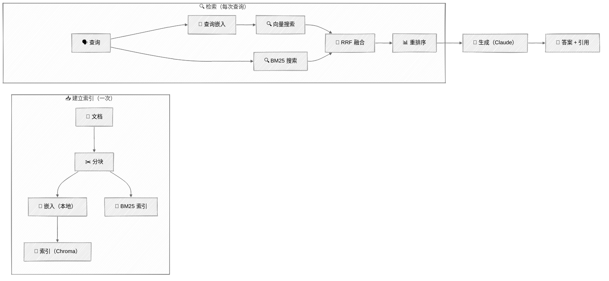
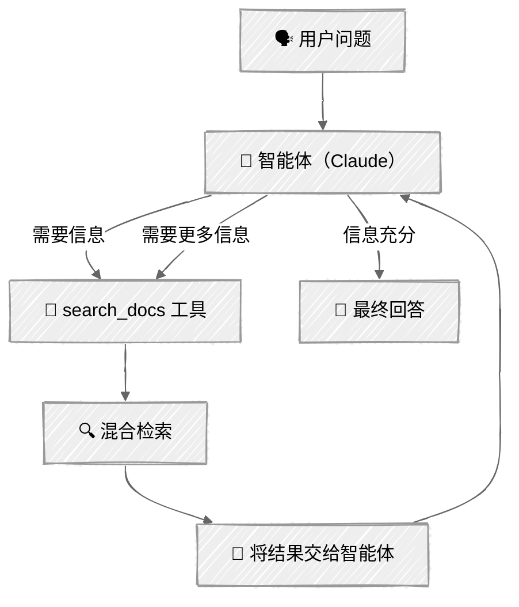

<!-- ---
title: "RAG 技术"
description: "使用混合搜索、重排序和智能体检索构建检索增强生成流水线"
icon: "search"
--- -->

# RAG 技术

大多数 AI 智能体都需要回答模型训练数据之外的问题，例如公司文档、产品手册和代码库中的内容。RAG（检索增强生成）弥补了这一差距：从知识库中检索相关上下文，并将其与问题一起提供给模型。

但朴素 RAG（嵌入所有内容、检索前 5 条，然后寄希望于结果）存在许多已知的失效模式。本教程介绍让 RAG 真正有效的工程方法：混合搜索、重排序，以及由智能体决定何时搜索和搜索什么的智能体检索。

## 🎯 你将学到什么

- 构建完整的 RAG 流水线：摄取、分块、嵌入、索引、检索和生成
- 使用本地 sentence-transformer 生成嵌入向量（无需 API 密钥）
- 通过倒数排名融合，将 BM25 关键词搜索与向量搜索结合起来
- 使用 FlashRank 对结果重排序，在不产生 API 费用的情况下提高准确率
- 构建由智能体将检索作为工具自主控制的智能体 RAG 系统
- 理解何时应使用 RAG，何时只需将所有内容放入上下文窗口

## 📦 可用示例

| 提供商 | 文件 | 说明 |
| --- | --- | --- |
|  | [01_rag_pipeline_anthropic.py](01_rag_pipeline_anthropic.py) | 使用混合搜索的完整 RAG 流水线 |
|  | [02_agentic_rag_anthropic.py](02_agentic_rag_anthropic.py) | 智能体通过工具调用自主控制检索 |

## 🚀 快速入门

> **前置条件：** Python 3.11+、API 密钥和 uv。完整配置说明请参阅 [SETUP.md](../../SETUP.md)。

本教程需要一个 API 密钥：

- `ANTHROPIC_API_KEY` — 用于 Claude（生成）

嵌入模型通过 `sentence-transformers` 在本地运行（`all-MiniLM-L6-v2`，首次运行时下载约 80MB）。

```bash
# RAG 流水线演示
uv run --directory 03-advanced-techniques/06-rag-techniques python 01_rag_pipeline_anthropic.py

# 智能体 RAG 演示
uv run --directory 03-advanced-techniques/06-rag-techniques python 02_agentic_rag_anthropic.py
```

也可以使用 VS Code 的 [Code Runner](https://marketplace.visualstudio.com/items?itemName=formulahendry.code-runner) 扩展，单击即可运行当前打开的脚本。

首次运行会下载嵌入模型（约 80MB）和重排序模型（约 4MB），然后为示例文档生成嵌入向量。后续运行将从持久化的 ChromaDB 索引中加载数据。

## 🔑 关键概念

### 1. 何时使用 RAG

并非每个应用都需要 RAG。应根据知识库大小及其更新频率来选择：

| 场景 | 方法 | 原因 |
| --- | --- | --- |
| 知识库小于 20 万 Token | 直接填充上下文 | 将所有内容直接放入提示词，更简单、更可靠 |
| 静态知识、大量查询 | RAG | 将一次性的嵌入成本分摊到大量查询中 |
| 频繁更新的知识 | RAG | 无需重新训练，只需为变更文档重建索引 |
| 模型需要引用来源 | RAG | 检索到的文本块天然包含来源信息 |
| 通用知识问题 | 不需要 RAG | 模型已经掌握，无需重复检索 |

### 2. RAG 流水线

<!-- prettier-ignore -->


### 3. 分块

文档会被切分成适合嵌入、同时又足以保留语义的文本块。这里使用递归切分：先尝试段落、行和句子等自然边界，最后才按字符切分：

```python
chunks = recursive_split(
    text,
    source="api_reference.md",
    chunk_size=512,      # 目标字符数
    chunk_overlap=64,    # 重叠内容可避免丢失边界处的上下文
)
```

为什么采用递归切分？因为它会尊重文档结构：段落边界显然比句子中间更适合作为切分点，而重叠内容可以避免丢失横跨两个文本块的信息。

### 4. 嵌入

这里使用 [sentence-transformers](https://www.sbert.net/) 的 `all-MiniLM-L6-v2` 模型。它是一个轻量级模型（约 80MB），无需 API 密钥即可在本地运行，并可生成适合语义搜索的 384 维嵌入向量：

```python
from sentence_transformers import SentenceTransformer

model = SentenceTransformer("all-MiniLM-L6-v2")

# 为文档生成用于索引的嵌入向量
doc_embeddings = model.encode(["文档内容", ...])

# 为搜索查询生成嵌入向量
query_embedding = model.encode("搜索查询")
```

对于准确率要求更高的生产工作负载，可以考虑 Voyage AI 或 OpenAI Embeddings 等基于 API 的嵌入服务。它们提供规模更大、能够区分文档与查询的模型，可进一步提高检索质量。

### 5. 为何采用混合搜索

向量搜索可以找到语义相似的内容，但可能漏掉精确匹配；BM25 关键词搜索擅长查找准确术语，却可能漏掉同义改写。结合二者可以取长补短：

```
查询：“专业版套餐的速率限制是多少？”

向量搜索找到：
  ✓ “按 API 密钥执行速率限制……”                 （语义匹配）
  ✗ 漏掉列表中明确提到的“专业版套餐”

BM25 搜索找到：
  ✓ “专业版：每分钟 500 个请求，每天 50,000 个”  （关键词精确匹配）
  ✗ 漏掉语义相关的速率限制概念

混合搜索（二者 + RRF 融合）：
  ✓ 同时返回两类结果，兼得二者优势
```

**倒数排名融合（RRF）**用于合并两个排名列表。每个结果的分数等于它在各列表中的 `1/(k + rank)` 之和；同时出现在两个列表中的结果会获得更高分。原始论文采用的常量 `k=60` 可以减弱排名位置的影响。

### 6. 重排序

先检索较多候选结果（20 条以上），再重排序并取前 5 条。重排序器（交叉编码器模型）直接为每个“查询—文档”对评分，比向量相似度更准确，但速度较慢，不适合在整个文档集合上运行：

```
重排序前（按 RRF 分数）：
  1. 速率限制概述                           ← 相关但不具体
  2. 专业版：每分钟 500 个请求，每天 50,000 个 ← 正是所需内容
  3. 身份验证方式                           ← 不相关
  4. 速率限制错误（429）的处理方式           ← 部分相关
  5. 企业版套餐详情                         ← 套餐不符

重排序后（按交叉编码器相关性）：
  1. 专业版：每分钟 500 个请求，每天 50,000 个 ← 提升到首位
  2. 速率限制错误（429）的处理方式           ← 有用的上下文
  3. 速率限制概述                           ← 补充信息
```

这里使用 [FlashRank](https://github.com/PrithivirajDamodaran/FlashRank)，它是一个轻量级重排序器（约 4MB 的 ONNX 模型），可在 CPU 上运行且无需 API 密钥。

### 7. 流水线 RAG 与智能体 RAG

脚本 01 是一条**流水线**：每个问题都会触发相同的“检索 → 生成”流程。脚本 02 是一个**智能体**：由 LLM 决定是否检索以及如何检索。

| 方面 | 流水线 RAG | 智能体 RAG |
| --- | --- | --- |
| 检索触发条件 | 每个问题 | 智能体决定 |
| 搜索查询 | 直接使用用户的问题 | 智能体自行拟定查询 |
| 多步检索 | 不支持 | 智能体可以多次搜索 |
| 追问 | 每个问题相互独立 | 智能体使用对话上下文 |
| 复杂度 | 简单、可预测 | 更灵活、可预测性较低 |
| 适用场景 | 单轮问答、搜索界面 | 对话助手、复杂查询 |

<!-- prettier-ignore -->


## 🏗️ 代码结构

### `rag/` 包

```python
# rag/chunker.py
def recursive_split(text, source, chunk_size=512, chunk_overlap=64) -> list[Chunk]: ...

# rag/embedder.py
class LocalEmbedder:
    def embed_documents(self, texts: list[str]) -> list[list[float]]: ...
    def embed_query(self, query: str) -> list[float]: ...

# rag/store.py
class VectorStore:
    def add_chunks(self, chunks: list[Chunk]) -> None: ...
    def vector_search(self, query: str, top_k: int) -> list[tuple[Chunk, float]]: ...
    def keyword_search(self, query: str, top_k: int) -> list[tuple[Chunk, float]]: ...

# rag/retriever.py
class HybridRetriever:
    def retrieve(self, query: str, top_k: int = 5) -> list[Chunk]: ...

# rag/reranker.py
class Reranker:
    def rerank(self, query: str, chunks: list[Chunk], top_k: int) -> list[Chunk]: ...
```

### 脚本 01——流水线 RAG（RAGPipeline）

```python
class RAGPipeline:
    def ingest(self, docs_dir: Path) -> int: ...
    def query(self, question: str) -> tuple[str, list[Chunk]]: ...
```

### 脚本 02——智能体 RAG（AgenticRAG）

```python
class AgenticRAG:
    def chat(self, user_input: str, console: Console) -> str: ...
```

## ⚠️ 重要考虑因素

- **需要一个 API 密钥**——Claude 使用 `ANTHROPIC_API_KEY`；本地嵌入无需 API 密钥。
- **首次运行准备**——首次运行会下载嵌入模型（约 80MB）和 FlashRank 重排序模型（约 4MB），然后生成嵌入向量。后续运行将从持久化的 `.chroma_db/` 目录加载。删除 `.chroma_db/` 可强制重建索引。
- **嵌入质量优先于检索技巧**——再好的检索策略也无法挽救质量低劣的嵌入。应先选择良好的嵌入模型，再调优检索策略。
- **文本块大小的权衡**——较小的文本块（256）检索更精确，但容易丢失上下文；较大的文本块（1024）能保留更多上下文，但准确率较低。512 是实用的默认值。
- **规模化成本**——嵌入成本只在建立索引时产生一次；本地 ChromaDB + BM25 检索免费；只有生成调用会按查询产生费用。
- **生产环境注意事项**——本教程使用基于文件的 ChromaDB。生产环境可考虑托管向量数据库（Pinecone、Weaviate）以及提供批量定价的托管嵌入 API。

## 👉 后续步骤

构建 RAG 流水线后，可以继续：

- **[多模态](../07-multimodal/)**——在处理文本的同时处理图像、生成视觉内容并处理音频
- **实验**——尝试不同的文本块大小（256、512、1024）并比较检索质量
- **探索**——将自己的文档添加到 `sample_docs/`，观察流水线如何处理
- **进阶**——阅读 [Anthropic 的上下文检索](https://www.anthropic.com/news/contextual-retrieval)，了解如何在生成嵌入前使用文档级上下文丰富文本块
